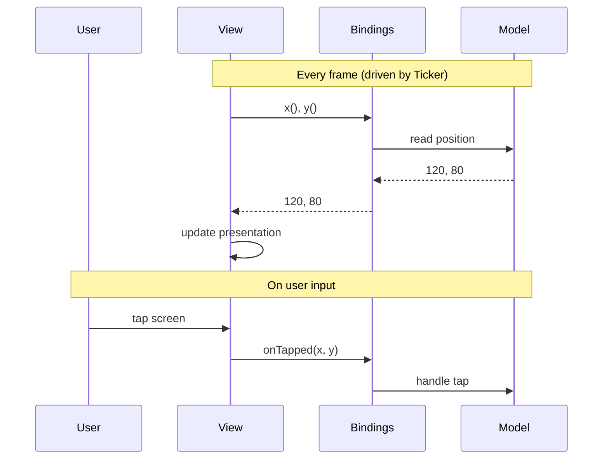

# Bindings

> Bindings are the contract between a view and the rest of the application.
> *Query bindings* read state; *relay bindings* report user input. This keeps
> views decoupled from models and independently testable.

**Previous:** [Views](views.md) · **Next:** [View Composition](view-composition.md)

---

## What are Bindings?

A bindings object is a plain object that a view receives when it is built,
with two kinds of members:

| Kind               | Purpose             | Direction     | Example                                    |
| ------------------ | ------------------- | ------------- | ------------------------------------------ |
| **Query binding**  | Read current state  | Model -> View | `x: () => number`                          |
| **Relay binding**  | Report user input   | View -> Model | `onTapped: (x: number, y: number) => void` |

In this project, a query binding is named for what it returns (`x`, `score`,
`isVisible`), and a relay binding is `on` followed by what the user did
(`onTapped`, `onFirePressed`). That naming is a project convention, not an MVT
requirement; see
[Style Guide: Views and Bindings](../../reference/style-guide.md#views-and-bindings).
For the language-neutral specification, see
[Architecture: Bindings](../../architecture/bindings.md).



## A Minimal Example

A view that tracks a moving bullet's position:

```ts
interface BulletViewBindings {
    x: () => number;
    y: () => number;
    isVisible: () => boolean;
}

function BulletView(bindings: BulletViewBindings): Container {
    const view = new Container();
    const gfx = new Graphics();
    gfx.circle(0, 0, 4).fill(0xffffff);
    view.addChild(gfx);

    function refresh(): void {
        view.visible = bindings.isVisible();
        view.position.set(bindings.x(), bindings.y());
    }

    setTickMethods(view, { refresh });
    return view;
}
```

The bindings interface is a complete list of everything the view needs - no
hidden coupling, no guessing about dependencies.

## Query Bindings Read State, Relay Bindings Report User Input

The two kinds of bindings serve opposite directions:

**Query bindings** are read every frame in `refresh()`. Each one returns the
current value of some state the view presents, typically read from a model.
The view uses it to update the presentation output.

**Relay bindings** are called in response to user input (key presses, taps,
mouse clicks). Each one reports what the user did, typically to a model
method, where it will be processed on the next `update()` call. Name a relay
binding for what the user did, not for what it should cause: `onFirePressed`
reports an input, where `onShoot` would decide what the input means, which is
the wiring's job, not the view's.

```ts
interface ButtonViewBindings {
    label: () => string;
    isEnabled: () => boolean;
    onClicked?: () => void;
}

interface DragViewBindings {
    x: () => number;
    y: () => number;
    onDragged?: (x: number, y: number) => void;
}
```

## Why Not Just Pass the Model?

Three concrete benefits of the bindings indirection:

- **Decoupling** - the view doesn't know which model (or mock) provides the
  data. Swap implementations freely.
- **Testability** - pass mock bindings returning fixed values; assert the view
  renders correctly without needing a real model.
- **Explicit dependencies** - the bindings type is a complete manifest of
  everything the view needs.

## Wiring Bindings

The code that constructs the view is responsible for wiring its bindings -
answering its query bindings from model properties and connecting its relay
bindings to model methods. This typically happens in a parent view:

```ts
function GameView(bindings: GameViewBindings): Container {
    const { model } = bindings;
    const view = new Container();

    // Wire HUD bindings from model properties
    view.addChild(
        HudView({
            score: () => model.score,
            lives: () => model.lives,
            wave: () => model.wave,
        }),
    );

    // Wire the ship's bindings from a child model
    view.addChild(
        ShipView({
            x: () => model.ship.x,
            y: () => model.ship.y,
            angle: () => model.ship.angle,
            isAlive: () => model.ship.isAlive,
            isThrusting: () => model.ship.isThrusting,
        }),
    );

    return view;
}
```

Each binding is a simple arrow function that reads a model property. The
child view doesn't know the model exists - it only sees its bindings
interface. The same wiring in a JSX body reads as a tree:

```tsx
function GameView(bindings: GameViewBindings): Container {
    const { model } = bindings;
    return (
        <container>
            <HudView
                score={() => model.score}
                lives={() => model.lives}
                wave={() => model.wave}
            />
            <ShipView
                x={() => model.ship.x}
                y={() => model.ship.y}
                angle={() => model.ship.angle}
                isAlive={() => model.ship.isAlive}
                isThrusting={() => model.ship.isThrusting}
            />
        </container>
    );
}
```

A view is the same function either way, so `HudView` works as a tag and as a
plain call, whichever kind of body `HudView` itself has.

## Changeable Bindings Must Be Re-read Every Frame

A query binding given as a function is **changeable** - its value may change
between frames. A view must never read it once at construction and keep the
result:

```ts
// Wrong - read once at construction, never updates
function BadView(bindings: MyViewBindings): Container {
    const rows = bindings.rows(); // frozen forever
    // ...
}

// Correct - re-read every frame
function GoodView(bindings: MyViewBindings): Container {
    const view = new Container();

    function refresh(): void {
        const rows = bindings.rows(); // always current
        // ...
    }

    setTickMethods(view, { refresh });
    return view;
}
```

If the model replaces its internal state (e.g. on reset), the view
automatically picks up the new values on the next frame.

A view that does not support a value changing, such as a size its whole
layout is built around, says so in its bindings type: `rows: number` rather
than `rows: () => number`. That states a limitation, which can be relaxed
later without breaking callers; see
[Bindings in Depth](bindings-in-depth.md#fixed-and-changeable-binding-values).

## When to Use Bindings vs Direct Model Access

Not every view needs bindings. MVT recognises three access patterns:

| View kind                      | Access pattern                  | Rationale                                     |
| ------------------------------ | ------------------------------- | --------------------------------------------- |
| **Top-level application view** | Model(s) directly               | Application-specific; biggest bindings savings |
| **Leaf / reusable view**       | Query and relay bindings        | Small interface cost; genuine reuse potential  |
| **Static configuration**       | Ambient constants               | Never changes at runtime; not reactive state   |

**Top-level views** are the least likely to be reused - they exist to wire this
specific application's sub-views together. They're also the views with the
largest bindings surface area. Letting them read model properties directly
eliminates an entire adapter layer. In this project, a top-level view takes the
model as its one binding (`GameView({ model })`), so it has the same signature
as every other view.

**Leaf views** (views of single game objects, HUD panels, overlays) are natural reuse
candidates. The bindings interface gives them an adapter layer: if a model's
property is named `posX` but the view expects `x`, only the wiring
changes.

For more on optional bindings, fixed and changeable binding values, and
advanced access patterns, see [Bindings in Depth](bindings-in-depth.md).

---

**Next:** [View Composition](view-composition.md)
