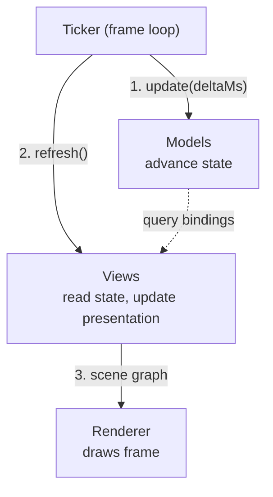
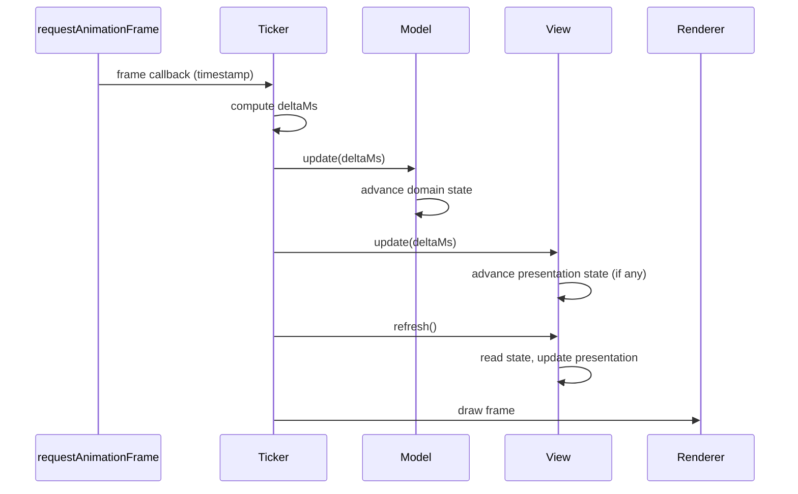

# The Game Loop

> The ticker drives the game loop: compute deltaMs, advance models, refresh
> views, render. Every frame, every time, in that order. This page covers the
> top-level loop that runs your game.

**Related:** [Architecture: The Ticker](../architecture/ticker.md) ·
[Time Management](simulating-the-world/time-management.md) · [Hot Paths](performance/hot-paths.md)

---

## The Big Picture

Each frame, the ticker runs three steps in strict order:



1. **Update models** - the ticker passes `deltaMs` to models. Models advance
   their domain state by the elapsed time.
2. **Refresh views** - views read settled state and update the scene graph.
   Views with cosmetic presentation state also receive `update(deltaMs)`.
3. **Render** - the renderer draws the frame.

Models always settle before views read them. Views never see a half-updated
world.

One turn of this loop is a [tick](../reference/glossary.md#tick). The word
covers each part too: ticking a model is calling its `update(deltaMs)`, and
ticking a view is calling its `update(deltaMs)`, if it has one, then its
`refresh()`. Each frame, the ticker ticks the models, then the views.

## The Frame Sequence in Detail

Every frame follows exactly the same sequence:



The ticker computes `deltaMs` from the timestamp difference between frames,
caps it to a maximum (preventing spiral-of-death when the tab was
backgrounded), and passes it to models. Once models have settled, views with
presentation state advance it via `update(deltaMs)`, then all views refresh.
Then the renderer draws.

## Where `deltaMs` Comes From

The ticker uses `requestAnimationFrame` to schedule frame callbacks. Each
callback receives a high-resolution timestamp. The ticker computes `deltaMs`
as the difference between the current and previous timestamps:

```ts
let lastTime = 0;

function frame(timestamp: number): void {
    const deltaMs = timestamp - lastTime;
    lastTime = timestamp;

    // Cap to prevent spiral-of-death after backgrounding
    const clampedDelta = Math.min(deltaMs, 100);

    gameSession.update(clampedDelta);                       // models
    tickScene({ root: app.stage, deltaMs: clampedDelta });  // views: update, then refresh
    app.render();

    requestAnimationFrame(frame);
}
```

The cap (typically 100ms) prevents a spiral-of-death: if the browser tab was
backgrounded for seconds, the accumulated delta would be enormous, causing
models to over-advance and potentially break assumptions.

## Why This Order Matters

The strict update-then-refresh sequence provides three guarantees:

**Models settle first.** When views read state, every model has finished
advancing. No view sees a half-updated world where one object has moved but
another hasn't.

**Multiple views stay in sync.** Two views reading the same model property
will always see the same value. A grid view and an overlay view both reading
`game.phase` will agree, because the model finished updating before either
view refreshed.

**No feedback loops.** Views don't mutate models during refresh (user input
is reported through relay bindings and processed on the next update cycle).
The data flow is one-directional within each frame: models produce state,
views consume it.

## Component Summary

| Component    | Owns                                   | Receives                            | Produces                               | Must not                                |
| ------------ | -------------------------------------- | ----------------------------------- | -------------------------------------- | --------------------------------------- |
| **Model**    | State, domain logic, transitions       | `deltaMs` via `update()`            | Readable state (properties, accessors) | Know about views, use wall-clock time   |
| **View**     | Presentation (+ optional cosmetic state) | State via query bindings; `deltaMs` via `update()` for views with state | Presentational output, user input via `bindings.on*()` | Hold domain state, run autonomous animations |
| **Ticker**   | Frame loop, timing                     | `requestAnimationFrame` callbacks   | `deltaMs` for models, `refresh` calls  | Contain domain logic or rendering code  |

## What the Ticker Does NOT Do

The ticker is purely a timing orchestrator:

| Responsibility                      | Belongs to  |
| ----------------------------------- | ----------- |
| Game rules, scoring, collisions     | Models      |
| Presentation output                 | Views       |
| Input handling and dispatch         | Views (via relay bindings)   |
| Deciding what `deltaMs` to pass     | **Ticker**  |
| Calling `update()` and triggering render | **Ticker** |

The ticker can support **pausing** (stop calling `update()` but continue
rendering) and **speed control** (multiply `deltaMs` before passing it).
Models don't know or care - they only ever see the `deltaMs` they receive.

## In This Project: The Ticker Ticks Models, Then the Scene

MVT requires the order above, not a particular mechanism. This project
implements the view side with [`packages/pixi/src/`](https://github.com/yortus/mvt-games/tree/main/packages/pixi/src):
a view sets its two steps on its Pixi `Container` with `setTickMethods`, and
the host ticks the whole scene with `tickScene`. This is a **project
convention**, not part of MVT itself.

```ts
setTickMethods(view, {
    update: (deltaMs) => { flash.update(deltaMs); },   // advance cosmetic presentation state
    refresh: () => { view.alpha = flash.alpha; },      // read state, write presentation output
});
```

| Member | MVT step | Set on |
| --- | --- | --- |
| `update: (deltaMs) => { ... }` | a view's `update(deltaMs)`: advance cosmetic presentation state | only views that have presentation state |
| `refresh: () => { ... }` | a view's `refresh()`: read state, write presentation output | every view that shows state |

Each frame, the host does this:

```ts
cabinet.update(deltaMs);                       // 1. the models advance
tickScene({ root: app.stage, deltaMs });       // 2. the update scene pass, then the refresh scene pass
// 3. Pixi renders
```

- **A tick of the scene is two scene passes.** The update scene pass walks the
  subtree it is given and calls every update method it finds, parents before
  children; then the refresh scene pass does the same for every refresh
  method. A view anywhere in the tree takes part just by setting its methods;
  its parents do not need to know it exists or pass anything on.
- **Sessions advance only their models.** A game session's `update()` runs its
  model and nothing else. The host (`site/src/main.ts`) ticks the whole stage once
  per frame, after the models.
- **Pausing is the host's call.** While paused, the host stops advancing the
  models, and its game container sits out the update scene pass. It is still
  refreshed, so the pause menu shows over the frozen game. No game knows about
  pause.
- **Skipping a subtree.** Either method may return `SKIP_DESCENDANTS` to skip
  its container's descendants for that scene pass, for example a hidden panel
  whose contents need not refresh. Visibility alone skips nothing.
- **Stepping the two apart.** `tickScene({ root, deltaMs, only: 'update' })`
  and `tickScene({ root, only: 'refresh' })` run one scene pass each, for a
  caller that needs many updates and then one refresh, such as rendering a
  thumbnail.
- **Why not Pixi's `onRender`?** It fires during rendering, so it is tied to
  render cadence and cannot skip a subtree. The
  [`packages/pixi/src/` README](https://github.com/yortus/mvt-games/blob/main/packages/pixi/src/README.md)
  explains the difference in full.

## Hierarchies

In practice, models and views each form trees - a root model composes child
models, and a root view composes child views. The ticker only talks to the
roots. Models delegate `update(deltaMs)` to their children explicitly, because
the order of child updates and cross-model checks is domain logic. Views do not
need to: in this project the scene passes walk the view tree for them (see
above). The frame sequence is the same regardless of tree depth.

## Key Constraints at a Glance

- **Models own time.** All state advances through `update(deltaMs)`. No
  `setTimeout`, no `Date.now()`, no auto-playing animations.

- **Views hold no domain state.** They read current state and update the
  presentation. Views may hold cosmetic presentation state for transitions
  the model doesn't track (see
  [Presentation State](adding-visual-polish/presentation-state.md)).

- **The ticker orchestrates, nothing more.** It drives the frame loop but
  contains no domain logic or rendering code.

- **Hot paths stay lean.** `update()` and `refresh()` run every frame. Avoid
  per-tick heap allocations.
  ([Hot Paths](performance/hot-paths.md))

For the language-neutral specification, see the
[Architecture](../architecture/index.md) section.

---

**Previous:** [Quickstart](quickstart.md) -
**Next:** [Models](simulating-the-world/models.md)
