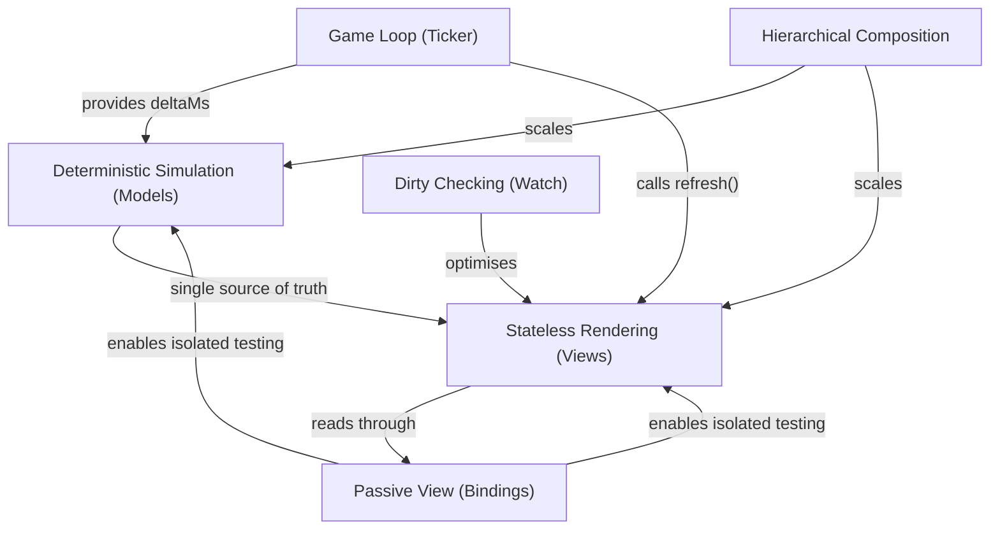

# Proven Patterns Behind MVT

> You don't need to read this to use MVT. It's here for those who want to
> understand the engineering heritage behind the architecture.

**Related:** [Architecture Overview](../learn/architecture-overview.md) ·
[Architecture Rules](../reference/architecture-rules.md) ·
[Glossary](../reference/glossary.md)

---

MVT is not a novel invention. It assembles a small set of well-established,
battle-tested architectural patterns into a single coherent framework for
frame-based interactive applications. Every piece has decades of proven use in
game engines, UI frameworks, and software engineering at large. MVT's
contribution is combining them into a consistent, easy-to-learn architecture
for frame-based interactive applications.

This document maps each MVT concept to its roots and explains why the
combination works.

---

## The Patterns Behind MVT

### The Game Loop (Ticker)

**MVT concept:** The Ticker calls `model.update(deltaMs)` then `view.refresh()`
then renderer draws, once per frame, continuously.

**Established pattern:** The **Game Loop** - a fixed-structure frame loop that
drives simulation and rendering in lockstep. Described in
_Game Programming Patterns_ as a core architectural pattern, and
standard practice in every major game engine (see
[Further Reading](#further-reading)):

| Engine | Equivalent                        |
| ------ | --------------------------------- |
| Unity  | `MonoBehaviour.Update(deltaTime)` |
| Unreal | `AActor::Tick(DeltaSeconds)`      |
| Godot  | `Node._process(delta)`            |

**Why it's proven:** The game loop has been the backbone of interactive
applications since the earliest video games. It provides predictable frame
pacing, a clear place for each concern (simulate, then render), and a single
point of control for time flow (pause, slow-motion, fast-forward). In a canvas
application where entities move every frame, a continuous loop is the natural
fit - every frame reads current state and renders directly.

**Learn more:** [The Ticker](../learn/ticker.md)

### Deterministic Simulation (Models)

**MVT concept:** Models advance state exclusively through `update(deltaMs)`.
No `setTimeout`, no `Date.now()`, no auto-playing animations. Time only enters
through the ticker's `deltaMs` parameter.

**Established pattern:** The **Update Method** pattern
(see [Further Reading](#further-reading)) and **deterministic simulation** -
a foundational technique in game engineering where identical inputs always
produce identical outputs.

**Why it's proven:** Deterministic simulation is the basis for:

- **Replay systems** - record inputs and `deltaMs` values, replay them to
  reproduce exact state sequences (used in every competitive game).
- **Lockstep networking** - synchronise multiplayer state by sharing only
  inputs, not full state (standard since _Age of Empires_, 1997).
- **Time manipulation** - pause, slow-motion, fast-forward, and frame-stepping
  all work by controlling what `deltaMs` the ticker provides. The model doesn't
  know or care.
- **Testing** - feed a known sequence of `update()` calls, assert exact state.
  No timing uncertainty, no flaky tests.

**Learn more:** [Models](../learn/models.md) ·
[Time Management](../guide/time-management.md)

### Passive View (Bindings)

**MVT concept:** Views receive a `bindings` object at construction.
`get*()` methods read state; `on*()` methods relay user input. Views never
import or reference models directly.

**Established pattern:** The **Passive View** variant of Model-View-Presenter
and the **ViewModel** concept from MVVM (see
[Further Reading](#further-reading)). In both patterns, the view has zero
knowledge of the model - it
interacts only through an intermediary interface that exposes exactly the data
and actions the view needs.

**Why it's proven:** Passive View and MVVM are the standard decoupling patterns
for UI architecture across platforms - WPF, Android (Jetpack), iOS (SwiftUI),
and web frameworks all use variations. The benefits are well-documented:

- **Substitutability** - swap the real model for a mock; the view doesn't know
  the difference. Enables isolated view testing.
- **Explicit surface area** - the bindings type is a complete manifest of every
  dependency the view has. No hidden coupling.
- **Independent development** - model and view can evolve separately as long as
  the bindings contract is maintained.

If you've used React, this will feel familiar - a component that receives data
via props and reports input via callback props is the same structural idea.

**Learn more:** [Bindings](../learn/bindings.md) ·
[Bindings in Depth](../guide/bindings-in-depth.md)

### Stateless Rendering (Views)

**MVT concept:** A view's `refresh()` function reads current state from
bindings and updates the presentation to match. No domain state, no memory of
previous frames, no autonomous behaviour.

**Established pattern:** **UI as a function of state** - the core insight
behind React, Elm, and immediate-mode GUI libraries like Dear ImGui
(see [Further Reading](#further-reading)). The view is a pure transformation:
`state -> presentation`.

**Why it's proven:** Stateless rendering eliminates an entire category of bugs
- stale state, inconsistent UI, missed update notifications, event ordering
problems. When the view always reads current state and produces corresponding
output, the display is guaranteed to be consistent with the model after every
frame.

**How MVT applies it:** Views update a persistent scene graph in `refresh()`.
The scene graph is retained (not rebuilt) for performance, but the _logic_ is
stateless - `refresh()` is idempotent, and calling it twice with the same
model state produces the same result.

**Learn more:** [Views](../learn/views.md) ·
[Presentation State](../guide/presentation-state.md) (the exception)

### Dirty Checking (Watch)

**MVT concept:** The `watch` helper polls a binding every frame and reports
whether the value changed. Views use it to skip expensive presentation rebuilds
when infrequently-changing values haven't moved.

**Established pattern:** **Dirty checking** - polling for changes rather than
relying on push notifications. The most prominent example is Angular 1's
digest cycle (2010), which checked all watched expressions every cycle and
updated the DOM only for those that changed.

**Why it's proven:** Dirty checking trades a small per-frame polling cost for
architectural simplicity - no observer subscriptions to manage, no event
listener cleanup, no risk of forgotten unsubscriptions or stale closures. In a
frame-loop context where `refresh()` already runs every tick, the polling cost
is near zero because you're already executing code every frame. (React's
`React.memo` and `useMemo` serve the same purpose - skip work when inputs are
unchanged.)

**Learn more:** [Change Detection](../guide/change-detection.md)

### Hierarchical Composition

**MVT concept:** Models compose into trees (parent delegates `update()` to
children). Views compose into trees (parent creates child views, each with its
own bindings). The two hierarchies are decoupled through bindings and do not
need to mirror each other.

**Established pattern:** The **Composite** pattern from _Design Patterns_
(see [Further Reading](#further-reading)) - treating individual objects and
compositions uniformly through a shared interface. Every UI framework uses
this: React's component
tree, the browser DOM, Unity's `GameObject` hierarchy, and Pixi.js's own
`Container` parent-child structure.

**Why it's proven:** Hierarchical composition allows complex systems to be built
from small, independently testable units. Add a new feature as a new
model/view pair without touching existing ones. The pattern scales from a
single entity to arbitrarily complex applications.

**Learn more:** [Model Composition](../guide/model-composition.md) ·
[View Composition](../guide/view-composition.md)

---

## Why These Patterns Fit Together

These aren't arbitrary choices - each pattern enables and reinforces the others:

The game loop requires models to be deterministic - if models used their own
timers, the ticker couldn't pause or control time.

Deterministic models provide a single source of truth, which makes stateless
views viable - there's no stale cache to invalidate, just read current state
every frame.

Because every view reads from the same post-`update()` snapshot, multiple views
can project from the same model data and stay perfectly in sync without any
coordination code between them.

Stateless views need explicit bindings so they don't create hidden dependencies
on specific model implementations. Explicit bindings enable testing both sides
in isolation - mock the bindings to test views, call `update()` directly to
test models.

Dirty checking slots cleanly into the frame-loop lifecycle since `refresh()`
runs every tick anyway.

Hierarchical composition lets each of these patterns scale from one model/view
to dozens without changing the architecture.

The result is a small set of rules that reinforce each other rather than
conflicting. Learn one, and the next follows naturally.

---

## Further Reading

- Robert Nystrom, [_Game Programming Patterns_](https://gameprogrammingpatterns.com/)
  (2014) - **Game Loop** and **Update Method** chapters. The definitive
  reference for the Ticker and Model `update()` patterns.
- Martin Fowler, ["Passive View"](https://martinfowler.com/eaaDev/PassiveScreen.html)
  (2006) - the decoupling pattern behind MVT's bindings. Part of Fowler's
  catalogue of UI architectural patterns.
- John Gossman, ["Introduction to Model/View/ViewModel"](https://learn.microsoft.com/en-us/archive/blogs/johngossman/introduction-to-modelviewviewmodel-pattern-for-building-wpf-apps)
  (2005) - the ViewModel concept, structurally identical to MVT's bindings
  object.
- Gamma, Helm, Johnson, Vlissides, [_Design Patterns_](https://en.wikipedia.org/wiki/Design_Patterns)
  (1994) - the Composite pattern used by both model and view hierarchies.
- Evan Czaplicki, ["The Elm Architecture"](https://guide.elm-lang.org/architecture/)
  (2012) - Model, update, view as a functional loop. MVT is a
  continuous-time, imperative-rendering adaptation of the same idea.
