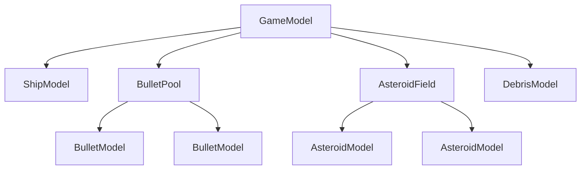

# Model Composition

> Complex applications break models into a tree. The root model's `update()`
> delegates to child models, each independently testable. Cross-cutting
> concerns like collisions and scoring live in the parent.

**Related:** [Models (Learn)](../learn/models.md) ·
[View Composition](view-composition.md) · [Testing](testing.md)

---

## Parent-Child Delegation

A root model composes child models and delegates `update(deltaMs)` calls down
the tree. Each child model is a focused, independently testable unit:

```ts
function createGameModel(options: GameModelOptions): GameModel {
    const ship = createShipModel(options.ship);
    const bullets = createBulletPool(options.bullets);
    const asteroids = createAsteroidField(options.asteroids);

    return {
        get ship() { return ship; },
        get bullets() { return bullets; },
        get asteroids() { return asteroids; },

        update(deltaMs) {
            ship.update(deltaMs);
            bullets.update(deltaMs);
            asteroids.update(deltaMs);

            // Cross-model logic after children have advanced
            checkCollisions(bullets, asteroids);
        },
    };
}
```

The parent calls `update()` on each child first, then handles cross-cutting
concerns. Children know nothing about each other - the parent orchestrates
their interactions.

## Model Tree Structure



The tree can be as deep as needed. A game model might compose a physics model,
which composes individual entity models. The ticker only talks to the root -
each level delegates to its children.

## Cross-Model Concerns

Some logic spans multiple child models: collision detection, scoring, phase
transitions, spawning. This logic belongs in the **parent** model that has
visibility into all the relevant children:

```ts
update(deltaMs) {
    // 1. Advance all children
    ship.update(deltaMs);
    for (let i = 0; i < asteroids.length; i++) asteroids[i].update(deltaMs);
    for (let i = 0; i < bullets.length; i++) bullets[i].update(deltaMs);

    // 2. Orchestrate cross-model interactions
    checkBulletsVsAsteroids();
    checkShipVsAsteroids();

    if (allAsteroidsDestroyed()) {
        scheduleNextWave();
    }
}
```

The advance-then-orchestrate pattern (see
[Time Management](time-management.md)) applies here: advance all children
first, then check conditions and trigger new sequences.

## Keeping Child Models Independent

Each child model should be testable without its parent or siblings:

```ts
test('ship rotates when direction is set', () => {
    const ship = createShipModel({
        startX: 200, startY: 200,
        rotationSpeed: 5,
    });

    ship.setRotationDirection('left');
    ship.update(1000); // 1 second

    expect(ship.angle).toBeCloseTo(-5);
});
```

No game model, no asteroids, no bullets - just the ship in isolation. The
parent model's responsibility is composing children and wiring their
interactions; each child's responsibility is its own domain logic.

## Sharing State Between Children

Children should not reference each other directly. When two children need to
interact, the parent mediates:

- **Collision detection** - the parent reads positions from both children and
  calls methods on the affected models (e.g. `asteroid.destroy()`,
  `ship.kill()`).
- **Scoring** - the parent increments a score counter when a collision is
  detected, rather than giving the bullet model access to the score model.
- **Spawning** - the parent creates new child models (e.g. splitting an
  asteroid into smaller ones) based on events detected during orchestration.

This keeps each child model self-contained and testable. The parent is the
only model that knows the full picture.

## Testing Composed Models

Test the root model to verify cross-cutting behaviour. Test children in
isolation as well:

```ts
test('bullet destroys asteroid on collision', () => {
    const game = createGameModel(options);
    // Position bullet and asteroid to overlap
    // ...
    game.update(16);
    expect(game.asteroids[0].isAlive).toBe(false);
});
```

For more on testing strategies, see [Testing](testing.md).
