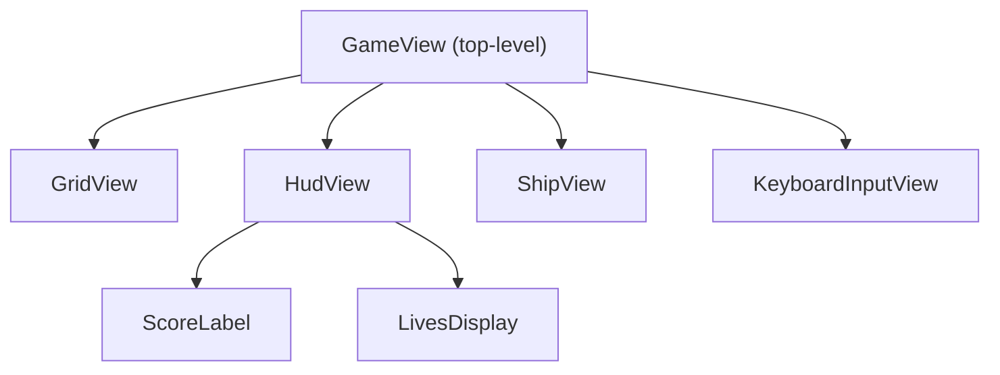

# View Composition

> Views compose hierarchically. A parent view creates child views, wires
> their bindings, and adds them to the presentation layer. The view tree does
> not need to mirror the model tree - views are structured for presentation
> needs, not model structure.

**Related:** [Views (Learn)](../learn/views.md) ·
[Model Composition](model-composition.md) · [Bindings in Depth](bindings-in-depth.md)

---

## Parent Views Wire Child Bindings

Views compose hierarchically. A parent view creates child views, each with its
own bindings, and adds them to the presentation layer.

The top-level application view typically receives model(s) directly and wires
bindings for each child. Child views know nothing about the model tree - they
only see their own `get*()`/`on*()` bindings:

```ts
function createGameView(game: GameModel): Container {
    const container = new Container();

    container.addChild(
        createGridView({
            getRows: () => game.grid.rows,
            getCols: () => game.grid.cols,
            getTileKind: (r, c) => game.grid.tileAt(r, c),
        }),
    );

    container.addChild(
        createHudView({
            getScore: () => game.score.score,
        }),
    );

    container.addChild(
        createKeyboardInputView({
            onDirectionChange: (dir) => {
                game.playerInput.direction = dir;
            },
        }),
    );

    return container;
}
```

Each child view is independent - it only knows about the `get*()` and `on*()`
members it needs.

## View Hierarchy



The top-level view is application-specific and receives the model directly.
Leaf views are reusable and receive bindings. This matches the two access
patterns described in [Bindings in Depth](bindings-in-depth.md).

## Multiple Views, One Model

Because models are the single source of truth and views only read state
through bindings, multiple views can project from the same model data and are
guaranteed to be perfectly in sync - without any coordination code between
them.

The ticker enforces this: all models update first, then all views refresh.
By the time any view reads a binding, every model has finished advancing. No
view sees a half-updated world, and no view needs to notify another that
something changed.

### Example: Same property, different reactions

A game phase property might be read by two views:

- A **grid view** rebuilds tiles on reset.
- An **overlay view** shows a game-over message.

Both are wired to the same model property:

```ts
// In the top-level view
createGridView({
    getPhase: () => game.phase,
    // ...
});

createOverlayView({
    getPhase: () => game.phase,
    // ...
});
```

The same model property drives two independent presentational responses - no
event wiring, no shared mutable flag, no risk of one view seeing `'playing'`
while the other sees `'game-over'`.

### Adding views without changing existing ones

Adding a new view that reads existing model state requires zero changes to
other views. Wire the bindings, and the new view automatically stays in sync.
This is a direct consequence of the pull-based architecture: views pull model state
each frame rather than subscribing to events from other views.

## Dynamic Child Views

When the number of entities changes at runtime (asteroids split, bullets fire
and expire), the parent view may use change detection to rebuild only the
affected child lists:

```ts
const watcher = watch({
    asteroidCount: () => game.asteroids.length,
});

function refresh(): void {
    const w = watcher.poll();
    if (w.asteroidCount.changed) {
        rebuildAsteroidViews();
    }
}
```

For the full change detection pattern, see
[Change Detection](change-detection.md).

---

## Model-View Mapping

Views do not need to be 1:1 with models. The view tree is structured around
presentation needs, which often differ from the model's domain structure.

### When 1:1 is natural

For simple games, each model entity has a corresponding view - a ball model
has a ball view, a paddle model has a paddle view. The view and model trees
happen to look similar because the presentation maps directly to the domain.

### When 1:1 breaks down

- **Multiple views per model.** A single game model might be read by a grid
  view, a HUD view, an overlay view, and a minimap view. There is one model
  but four views.
- **Views with no model counterpart.** Decorative elements (background
  parallax, particle effects, screen transitions) exist purely in the view
  tree and have no model.
- **Models with no view.** Some models are internal (e.g. a collision system
  or an AI planner) and are never rendered directly. Their effects are visible
  through other models that views do read.
- **Different granularity.** A model might expose a flat list of entities,
  while the view groups them by screen region for rendering efficiency. Or a
  model might have deeply nested children that a single view reads through
  bindings without mirroring the nesting.

The key principle: **bindings decouple the view tree from the model tree.**
Because views read state through `get*()` accessors rather than navigating
model internals directly, the two trees can be shaped independently.

---

For more on how the model side composes, see
[Model Composition](model-composition.md).