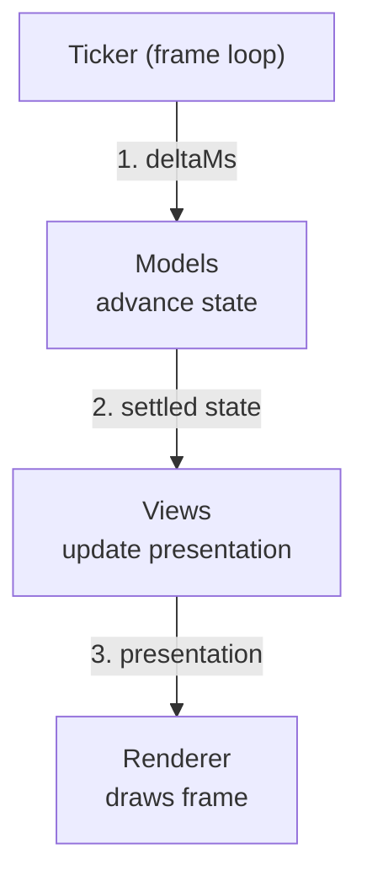
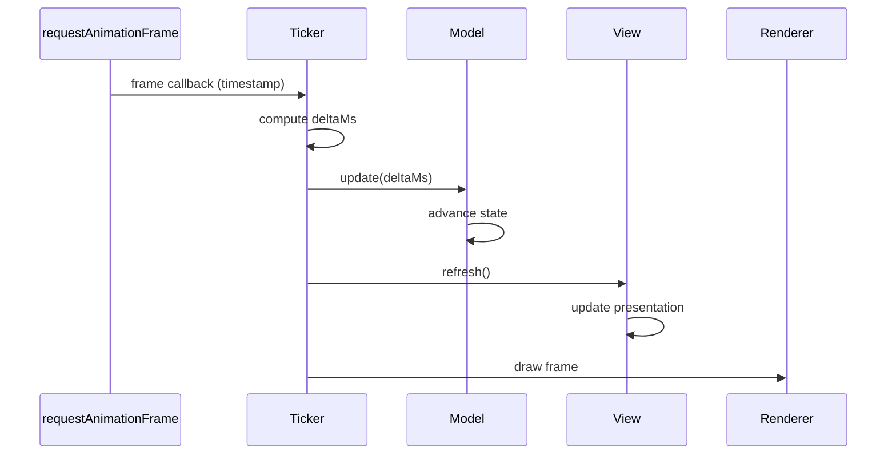

# Architecture Overview

> The MVT frame loop in one diagram: the ticker advances models, views read
> the settled state and update the presentation, then the renderer draws.
> Every frame, every time, in that order.

**Previous:** [What is MVT?](what-is-mvt.md) · **Next:** [Models](models.md)

---

## The Big Picture

Each frame, the ticker runs three steps in strict order:

1. **Update** - the ticker passes `deltaMs` to models. Models advance their
   state by the elapsed time.
2. **Refresh** - views read settled model state and update the presentation.
3. **Render** - the renderer draws the frame.

Models always settle before views read them. Views never see a half-updated
world.

In practice, models and views each form **hierarchies** - a root model
composes child models, and a root view composes child views. The ticker only
talks to the root; each root delegates to its children. The frame sequence
is the same regardless of tree depth.

## Component Summary

| Component  | Owns                                        | Receives                          | Produces                                              | Must not                                     |
| ---------- | ------------------------------------------- | --------------------------------- | ----------------------------------------------------- | -------------------------------------------- |
| **Model**  | State, domain logic, time-based transitions | `deltaMs` via `update()`          | Readable state (properties, accessors)                | Know about views, use wall-clock time        |
| **View**   | Presentation layer                          | State via `bindings.get*()`       | Presentational output, user-input events via `bindings.on*()` | Hold domain state, run autonomous animations |
| **Ticker** | Frame loop, timing                          | `requestAnimationFrame` callbacks | `deltaMs` for models, `refresh` calls for views       | Contain domain logic or rendering code       |

## The Frame Loop

Every frame follows exactly the same sequence:

The ticker computes `deltaMs` from the timestamp difference between frames,
caps it to a maximum (preventing spiral-of-death when the tab was
backgrounded), and passes it to models. Once models have settled, views refresh.
Then the renderer draws.

This is a **pull-based** architecture. Views pull the latest state from models
each frame, rather than models pushing changes to views via events. The
benefits: no subscriptions, no event wiring, no risk of stale or
double-handled notifications.

## Key Constraints at a Glance

These rules ensure the three layers stay cleanly separated. Each is explained
in depth on its own page:

- **Models own time.** All state advances through `update(deltaMs)`. No
  `setTimeout`, no `Date.now()`, no auto-playing animations.
  ([Models](models.md))

- **Views are stateless.** They read current state and update the
  presentation. No domain state, no timers, no logic beyond trivial
  transforms.
  ([Views](views.md))

- **The ticker orchestrates, nothing more.** It drives the frame loop but
  contains no domain logic or rendering code.
  ([The Ticker](ticker.md))

- **Bindings bridge views to models.** `get*()` reads state, `on*()` relays
  user input. Reusable views typically access state through bindings rather
  than importing models directly.
  ([Bindings](bindings.md))

- **Hot paths stay lean.** `update()` and `refresh()` run every frame. Avoid
  per-tick heap allocations.
  ([Hot Paths](../guide/hot-paths.md))

---

**Next:** [Models](models.md)
