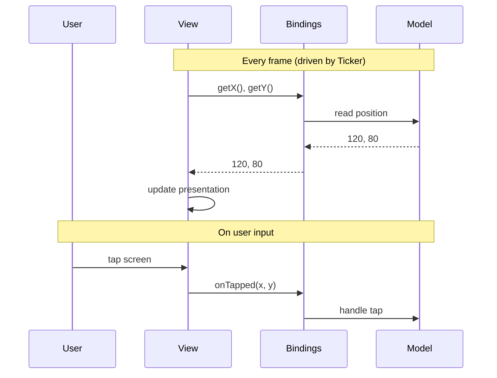

# Bindings

> Bindings are the contract between a view and the rest of the application.
> `get*()` methods read state, `on*()` methods relay user input. This keeps
> views decoupled from models and independently testable.

**Previous:** [The Ticker](ticker.md) · **Next:** [Walkthrough](walkthrough.md)

---

## What are Bindings?

A bindings object is a plain object with two kinds of members that a view
receives at construction time:

| Prefix   | Purpose            | Direction    | Example                                   |
| -------- | ------------------ | ------------ | ----------------------------------------- |
| `get*()` | Read current state | Model -> View | `getX(): number`                          |
| `on*()`  | Relay user input   | View -> Model | `onTapped(x: number, y: number): void`    |



## A Minimal Example

A view that tracks a moving entity's position:

```ts
interface EntityViewBindings {
    getX(): number;
    getY(): number;
    isVisible(): boolean;
}

function createEntityView(bindings: EntityViewBindings): Container {
    const view = new Container();
    const gfx = new Graphics();
    gfx.circle(0, 0, 4).fill(0xffffff);
    view.addChild(gfx);

    function refresh(): void {
        view.visible = bindings.isVisible();
        view.position.set(bindings.getX(), bindings.getY());
    }

    view.onRender = refresh;
    return view;
}
```

The bindings interface is a complete list of everything the view needs - no
hidden coupling, no guessing about dependencies.

## `get*()` Reads State, `on*()` Relays Input

The two kinds of bindings serve opposite directions:

**`get*()` bindings** are called every frame in `refresh()`. Each `get*()` binding returns the
current value of some state the view requires, typically wired to read from a model. The view uses it to update the presentation output.

**`on*()` bindings** are called in response to user input (e.g. key presses, taps, mouse
clicks). Each `on*()` binding relays a user input back out, typically to a model method, where it will be processed on the next `update()` call.

```ts
interface ButtonViewBindings {
    getLabel(): string;
    isEnabled(): boolean;
    onClicked?(): void;
}

interface DragViewBindings {
    getX(): number;
    getY(): number;
    onDragged?(x: number, y: number): void;
}
```

## Why Not Just Pass the Model?

Three concrete benefits of the bindings indirection:

- **Decoupling** - the view doesn't know which model (or mock) provides the
  data. Swap implementations freely.
- **Testability** - pass mock bindings returning fixed values; assert the view
  renders correctly without needing a real model.
- **Explicit dependencies** - the bindings type is a complete manifest of
  everything the view needs.

## Wiring Bindings

The code that constructs both the model and the view is responsible for wiring
the bindings - mapping model properties to `get*()` accessors and model methods
to `on*()` handlers. This typically happens in a parent view:

```ts
function createGameView(game: GameModel): Container {
    const container = new Container();

    // Wire HUD bindings from model properties
    container.addChild(
        createHudView({
            getScore: () => game.score.score,
            getLives: () => game.score.lives,
            getWave: () => game.wave,
        }),
    );

    // Wire entity bindings from a child model
    const shipView = createShipView({
        getX: () => game.ship.x,
        getY: () => game.ship.y,
        getAngle: () => game.ship.angle,
        isAlive: () => game.ship.isAlive,
        isThrusting: () => game.ship.isThrusting,
    });
    container.addChild(shipView);

    return container;
}
```

Each binding is a simple arrow function that reads a model property. The view
doesn't know the model exists - it only sees its bindings interface.

## Bindings Must Be Re-read Every Frame

Bindings are **reactive** - their values may change between frames. A view must
never cache a binding's return value at construction time:

```ts
// Wrong - cached at construction, never updates
function createBadView(bindings: MyBindings): Container {
    const rows = bindings.getRows(); // frozen forever
    // ...
}

// Correct - re-evaluated every frame
function createGoodView(bindings: MyBindings): Container {
    const container = new Container();

    function refresh(): void {
        const rows = bindings.getRows(); // always current
        // ...
    }

    container.onRender = refresh;
    return container;
}
```

If the model replaces its internal state (e.g. on reset), the view
automatically picks up the new values on the next frame.

## When to Use Bindings vs Direct Model Access

Not every view needs bindings. MVT recognises three access patterns:

| View kind                      | Access pattern                | Rationale                                     |
| ------------------------------ | ----------------------------- | --------------------------------------------- |
| **Top-level application view** | Model(s) directly             | Application-specific; biggest bindings savings |
| **Leaf / reusable view**       | `get*()`/`on*()` bindings     | Small interface cost; genuine reuse potential  |
| **Static configuration**       | Ambient constants             | Never changes at runtime; not reactive state   |

**Top-level views** are the least likely to be reused - they exist to wire this
specific application's sub-views together. They're also the views with the
largest bindings surface area. Letting them read model properties directly
eliminates an entire adapter layer.

**Leaf views** (entity renderers, HUD panels, overlays) are natural reuse
candidates. The bindings interface gives them an adapter layer: if a model's
property is named `posX` but the view expects `getX()`, only the wiring
changes.

For more on optional bindings, reactive bindings, and advanced access patterns,
see [Bindings in Depth](../topics/bindings-in-depth.md).

---

**Next:** [Walkthrough](walkthrough.md)
