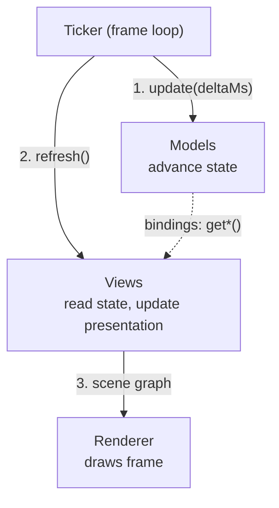
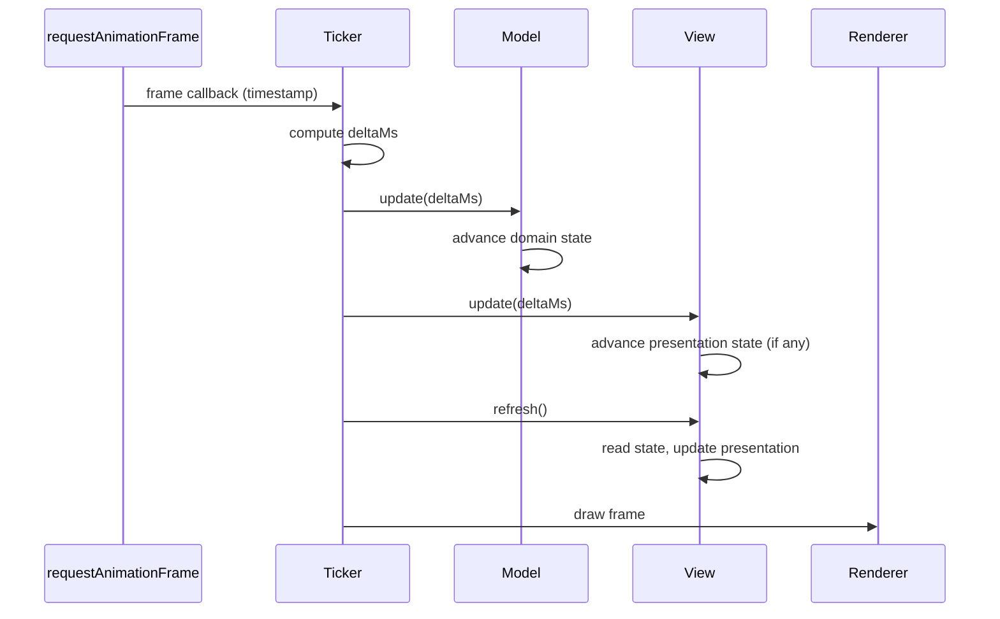

# The Game Loop

> The ticker drives the game loop: compute deltaMs, advance models, refresh
> views, render. Every frame, every time, in that order. This page covers the
> top-level loop that runs your game.

**Related:** [Architecture: The Ticker](../architecture/ticker.md) ·
[Time Management](../topics/time-management.md) · [Hot Paths](../topics/hot-paths.md)

---

## The Big Picture

Each frame, the ticker runs three steps in strict order:



1. **Update models** - the ticker passes `deltaMs` to models. Models advance
   their domain state by the elapsed time.
2. **Refresh views** - views read settled state and update the scene graph.
   Views with cosmetic presentation state also receive `update(deltaMs)`.
3. **Render** - the renderer draws the frame.

Models always settle before views read them. Views never see a half-updated
world.

## The Frame Sequence in Detail

Every frame follows exactly the same sequence:



The ticker computes `deltaMs` from the timestamp difference between frames,
caps it to a maximum (preventing spiral-of-death when the tab was
backgrounded), and passes it to models. Once models have settled, views with
presentation state advance it via `update(deltaMs)`, then all views refresh.
Then the renderer draws.

## Where `deltaMs` Comes From

The ticker uses `requestAnimationFrame` to schedule frame callbacks. Each
callback receives a high-resolution timestamp. The ticker computes `deltaMs`
as the difference between the current and previous timestamps:

```ts
let lastTime = 0;

function frame(timestamp: number): void {
    const deltaMs = timestamp - lastTime;
    lastTime = timestamp;

    // Cap to prevent spiral-of-death after backgrounding
    const clampedDelta = Math.min(deltaMs, 100);

    gameSession.update(clampedDelta);
    app.render();

    requestAnimationFrame(frame);
}
```

The cap (typically 100ms) prevents a spiral-of-death: if the browser tab was
backgrounded for seconds, the accumulated delta would be enormous, causing
models to over-advance and potentially break assumptions.

## Why This Order Matters

The strict update-then-refresh sequence provides three guarantees:

**Models settle first.** When views read state, every model has finished
advancing. No view sees a half-updated world where one entity has moved but
another hasn't.

**Multiple views stay in sync.** Two views reading the same model property
will always see the same value. A grid view and an overlay view both reading
`game.phase` will agree, because the model finished updating before either
view refreshed.

**No feedback loops.** Views don't mutate models during refresh (user input
is relayed through `on*()` bindings and processed on the next update cycle).
The data flow is one-directional within each frame: models produce state,
views consume it.

## Component Summary

| Component    | Owns                                   | Receives                            | Produces                               | Must not                                |
| ------------ | -------------------------------------- | ----------------------------------- | -------------------------------------- | --------------------------------------- |
| **Model**    | State, domain logic, transitions       | `deltaMs` via `update()`            | Readable state (properties, accessors) | Know about views, use wall-clock time   |
| **View**     | Presentation (+ optional cosmetic state) | State via `bindings.get*()`; `deltaMs` via `update()` for views with state | Presentational output, user input via `bindings.on*()` | Hold domain state, run autonomous animations |
| **Ticker**   | Frame loop, timing                     | `requestAnimationFrame` callbacks   | `deltaMs` for models, `refresh` calls  | Contain domain logic or rendering code  |

## What the Ticker Does NOT Do

The ticker is purely a timing orchestrator:

| Responsibility                      | Belongs to  |
| ----------------------------------- | ----------- |
| Game rules, scoring, collisions     | Models      |
| Presentation output                 | Views       |
| Input handling and dispatch         | Views (via `on*()` bindings) |
| Deciding what `deltaMs` to pass     | **Ticker**  |
| Calling `update()` and triggering render | **Ticker** |

The ticker can support **pausing** (stop calling `update()` but continue
rendering) and **speed control** (multiply `deltaMs` before passing it).
Models don't know or care - they only ever see the `deltaMs` they receive.

## Hierarchies

In practice, models and views each form trees - a root model composes child
models, and a root view composes child views. The ticker only talks to the
root; each root delegates to its children. The frame sequence is the same
regardless of tree depth.

## Key Constraints at a Glance

- **Models own time.** All state advances through `update(deltaMs)`. No
  `setTimeout`, no `Date.now()`, no auto-playing animations.

- **Views hold no domain state.** They read current state and update the
  presentation. Views may hold cosmetic presentation state for transitions
  the model doesn't track (see
  [Presentation State](../topics/presentation-state.md)).

- **The ticker orchestrates, nothing more.** It drives the frame loop but
  contains no domain logic or rendering code.

- **Hot paths stay lean.** `update()` and `refresh()` run every frame. Avoid
  per-tick heap allocations.
  ([Hot Paths](../topics/hot-paths.md))

For the language-neutral specification, see the
[Architecture](../architecture/index.md) section.
