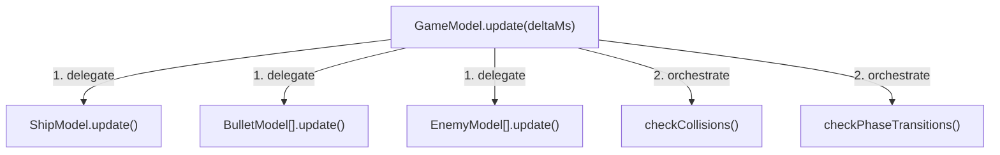

# Models

> A model owns state and domain logic. It advances through `update(deltaMs)`,
> knows nothing about views or rendering, and is fully testable in isolation.

**Previous:** [The Game Loop](game-loop.md) · **Next:** [Views](views.md)

---

## What is a Model?

A model is a **headless simulation**. It maintains state, enforces domain
rules, and defines how the application evolves over time - but it has no idea
how (or whether) it is being displayed. You could run a model in a terminal,
in a test harness, or with no output at all. Feed it a sequence of
`update(deltaMs)` calls and it produces a complete state history.

Models are the single source of truth - everything that matters about the
current state of the application lives in a model. Views are just windows
looking into that simulation.

For the language-neutral specification, see
[Architecture: Models](../architecture/models.md).

## A Minimal Model

Here is a simple model - a countdown timer that tracks remaining time:

```ts
interface TimerModel {
    /** Milliseconds remaining before the timer expires. */
    readonly remainingMs: number;
    /** True once the timer has reached zero. */
    readonly isExpired: boolean;
    update(deltaMs: number): void;
}

function createTimerModel(durationMs: number): TimerModel {
    let remainingMs = durationMs;

    return {
        get remainingMs() { return remainingMs; },
        get isExpired() { return remainingMs <= 0; },
        update(deltaMs) {
            if (remainingMs > 0) {
                remainingMs = Math.max(0, remainingMs - deltaMs);
            }
        },
    };
}
```

> **Try it live:** [Countdown Timer in Playground](/playground/#preset=countdown-timer)

Notice what happens each frame:

- The ticker calls `update(deltaMs)`, passing the elapsed milliseconds.
- The model subtracts that time from `remainingMs`.
- Once `remainingMs` hits zero, `isExpired` flips to `true`.

All state lives inside the model. There are no timers, no rendering calls, no
references to anything outside. The model is a headless simulation - it doesn't
know or care whether anything is watching.

## What MVT Requires of Models

MVT imposes two architectural constraints on models:

1. **An `update(deltaMs)` method** - the sole mechanism by which time flows
   into the model. No wall-clock time, no `setTimeout`, no auto-playing
   tweens.
2. **No references to views or rendering** - models are self-contained
   simulations that know nothing about how they are displayed.

Everything else - how you structure the code, whether you use classes or
factory functions, how you name things - is a style choice. The examples on
this page use the conventions of this repo (factory functions, closure-scoped
private state, getter-based interfaces). Other codebases using MVT could use
classes, MobX observables, or any other style without affecting the
architecture. See the [Style Guide](../reference/style-guide.md) for this
repo's specific conventions.

## The `update(deltaMs)` Contract

Every model exposes an `update(deltaMs)` method. The ticker calls it once per
frame, passing the number of milliseconds since the last frame. This is the
**sole mechanism** by which time flows into a model.

The contract guarantees:

- **Determinism** - same sequence of `update(deltaMs)` calls produces the same
  state. Unit tests can replay exact frame sequences.
- **Ticker control** - the ticker can pause, slow down, speed up, or
  single-step time. Models stay in sync because they only ever see `deltaMs`.
- **Consistent snapshots** - between model `update()` and view `refresh()`, model state
  is stable. No background timer can mutate it mid-frame.

### Testing a Model

Because models are deterministic, testing is straightforward - call `update()`,
assert state:

```ts
test('timer counts down and expires', () => {
    const timer = createTimerModel(3000);

    expect(timer.remainingMs).toBe(3000);
    expect(timer.isExpired).toBe(false);

    timer.update(1000);
    expect(timer.remainingMs).toBe(2000);

    timer.update(2000);
    expect(timer.remainingMs).toBe(0);
    expect(timer.isExpired).toBe(true);
});
```

No rendering context. No DOM. No timers. Just function calls and assertions.

## What Belongs in a Model

The core MVT principle: **models describe what is happening in domain terms;
views describe how it looks on screen.** Anything that would change if you
swapped the renderer belongs in the view, not the model.

| Concern            | Model                                                             | View                                                             |
| ------------------ | ----------------------------------------------------------------- | ---------------------------------------------------------------- |
| Position           | `row`, `col`, `heading`, world-units                              | Pixel coordinates, screen offsets                                |
| Speed              | tiles/s, world-units/s                                            | Derived from model position each frame                           |
| Size / extents     | grid cells, world-unit radius                                     | Pixel dimensions, sprite scale                                   |
| Colours & textures | Named state: `color: 'red'`, `phase: 'inflating'`                 | Actual hex values, texture lookups, tint                         |
| Animation progress | Sequence order: `inflationStage: 2`, `progress: 0.3`              | Sprite frame, alpha tween, particle burst                        |
| Layout             | Count of items, grid dimensions                                   | Pixel spacing, margins, font size                                |
| Audio              | Named events: `'pelletEaten'`, `'levelClear'`                     | Sound file, volume, pan                                          |
| Timing             | Internal timers via `update(deltaMs)`                             | Frame-synced presentation tweens                                 |

## What Does NOT Belong in a Model

Models are self-contained simulations. They must never reach outside themselves
for time or rendering:

| Forbidden                          | Why                                              |
| ---------------------------------- | ------------------------------------------------ |
| `setTimeout` / `setInterval`       | Fires on wall-clock time, not model time         |
| `requestAnimationFrame`            | Bypasses the ticker's `deltaMs` pipeline         |
| Auto-playing GSAP tweens           | GSAP's global ticker advances them independently |
| `Date.now()` / `performance.now()` | Wall-clock reads create non-determinism          |
| References to views                | Breaks layer separation                          |
| Pixel coordinates                  | Presentation-layer concern                       |

## Domain-Level Coordinates

Models must define positions, distances, and velocities in units that are
meaningful to the domain - not in pixels or any other presentation measure.

| Game style               | Natural unit             | Examples                        |
| ------------------------ | ------------------------ | ------------------------------- |
| **Tile/grid-based**      | Tiles (fractional)       | Pac-Man, Dig Dug, Tetris       |
| **Continuous open-world** | Metres or world-units   | Platformers, racing games       |
| **Fixed-arena action**   | Abstract world-units     | Asteroids, Galaga               |
| **Board/card**           | Slots / indices          | Chess squares, card positions   |

The model defines the world; the view decides how to draw it. Even if the
current view maps 1 world-unit to 1 pixel, that is a view-layer decision.

### Grid-based example

For grid-based entities, a model could expose fractional `row`/`col`. An integer
means "centred on that tile"; a fraction means "between tiles":

```ts
interface EntityModel {
    /** Row position - fractional while moving between tiles. */
    readonly row: number;
    /** Column position - fractional while moving between tiles. */
    readonly col: number;
    /** Current movement direction. */
    readonly direction: Direction;
    update(deltaMs: number): void;
}
```

The view converts to pixels:

```ts
// In a leaf view's refresh():
const pixelX = (bindings.getCol() + 0.5) * tileSize;
const pixelY = (bindings.getRow() + 0.5) * tileSize;
container.position.set(pixelX, pixelY);
```

### Continuous-space example

For open-arena games, define an abstract world-coordinate system and let the
view apply a scale factor:

```ts
// Model: arena and entities defined in world-units
const ARENA_WIDTH  = 400;  // world-units
const ARENA_HEIGHT = 400;  // world-units
const SHIP_RADIUS  = 10;   // world-units
const THRUST       = 200;  // world-units per second squared

// View: one-time scale factor from world-units to pixels
const SCALE = screenWidthPx / ARENA_WIDTH;
container.position.set(bindings.getX() * SCALE, bindings.getY() * SCALE);
```

## The Factory Function Pattern

This repo uses factory functions rather than classes to create models. This
is a style choice, not an MVT requirement - but it has advantages worth
understanding.

```ts
function createShipModel(options: ShipModelOptions): ShipModel {
    // Private state in closure scope
    let x = options.startX;
    let y = options.startY;
    let vx = 0;
    let vy = 0;

    // Public record satisfying the interface
    return {
        get x() { return x; },
        get y() { return y; },
        get vx() { return vx; },
        get vy() { return vy; },
        update(deltaMs) {
            const dt = deltaMs / 1000;
            x += vx * dt;
            y += vy * dt;
        },
    };
}
```

Key points:

- **Clean separation of interface and implementation.** The `ShipModel`
  interface defines the public contract. The factory's internal closure is the
  private implementation. Consumers depend only on the interface - they cannot
  reach into internals, and the implementation can change freely.
- **Private state is truly private.** `x`, `y`, `vx`, `vy` live in the
  closure, invisible to consumers. No `private` keyword needed - the language
  enforces it structurally.
- **Creation is decoupled from implementation.** Callers see `createShipModel(options) → ShipModel`.
  The factory could return a plain object, a proxy, or a test stub - the call
  site does not change.
- **The options object makes the factory extensible.** Add new optional fields
  without breaking existing call sites.

Classes work fine for simple cases and satisfy MVT equally well. The
architecture cares that a model has `update(deltaMs)` and stays independent
of views - not how it is constructed. That said, classes couple the interface
to the implementation (consumers import the class itself, not a separate
type), and construction is tied to a specific `new` call, making it harder to
substitute implementations in tests or swap in alternative strategies.

For this repo's full naming rules and code conventions, see
[Style Guide](../reference/style-guide.md).

## Model Composition

In practice, models form trees. A parent model creates child models and
delegates `update(deltaMs)` to each one. After children have updated, the
parent handles cross-cutting concerns like collisions or phase transitions:



Each child model is independently testable - call its `update()` directly
without the parent. The parent's tests focus on the orchestration: do
collisions register correctly? Do phases transition at the right time?

For more on composition patterns, see
[Model Composition](../topics/model-composition.md).

---

**Next:** [Views](views.md)
