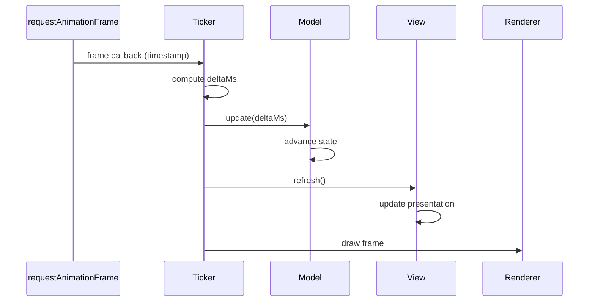

# The Ticker

> The ticker drives the frame loop: compute deltaMs, advance models, refresh
> views, render. It orchestrates timing but contains no domain logic or
> rendering code.

**Previous:** [Views](views.md) · **Next:** [Bindings](bindings.md)

---

## What is the Ticker?

The ticker is the orchestrator. It owns the frame loop and ensures that every
frame follows the same strict sequence: update models, refresh views, render.
It is the single point of control for time flow in the application.

## The Frame Sequence

Each frame proceeds in three steps, always in the same order:



1. **Update** - the ticker calls `model.update(deltaMs)`. Models advance their
   state based on elapsed time. By the end of this step, all model state is
   settled and consistent.

2. **Refresh** - the ticker triggers view refreshes. Views read settled model
   state through bindings and update the presentation. In this project,
   Pixi's render cycle drives refresh via `onRender` hooks.

3. **Render** - the renderer draws the frame. In this project, Pixi.js
   renders the scene graph; other renderers would draw their
   respective outputs.

## Where `deltaMs` Comes From

In a browser-based game, The ticker would typically use `requestAnimationFrame` to schedule frame callbacks. Each
callback receives a high-resolution timestamp. The ticker computes `deltaMs`
as the difference between the current and previous timestamps.

```ts
let lastTime = 0;

function frame(timestamp: number): void {
    const deltaMs = timestamp - lastTime;
    lastTime = timestamp;

    // Cap to prevent spiral-of-death after backgrounding
    const clampedDelta = Math.min(deltaMs, 100);

    gameSession.update(clampedDelta);
    app.render();

    requestAnimationFrame(frame);
}
```

The cap (typically 100ms) prevents a spiral-of-death: if the browser tab was
backgrounded for seconds, the accumulated delta would be enormous, causing
models to over-advance and potentially break assumptions about inter-tick
transitions.

## Why This Order Matters

The strict update-then-refresh sequence provides a consistency guarantee:

- **Models settle first.** When views read state, every model has finished
  advancing. No view sees a half-updated world where one entity has moved but
  another hasn't.

- **Multiple views stay in sync.** Two views reading the same model property
  will always see the same value. A grid view and an overlay view both reading
  `game.phase` will agree, because the model finished updating before either
  view refreshed.

- **No feedback loops.** Views don't mutate models during refresh (user input
  is relayed through `on*()` bindings and processed on the next update cycle).
  The data flow is one-directional within each frame: models produce state,
  views consume it.

## What the Ticker Does NOT Do

The ticker is purely a timing orchestrator:

| Responsibility                    | Belongs to  |
| --------------------------------- | ----------- |
| Game rules, scoring, collisions   | Models      |
| Presentation output             | Views       |
| Input handling and dispatch       | Views (via `on*()` bindings) |
| Deciding what `deltaMs` to pass   | **Ticker**  |
| Calling `update()` and triggering render | **Ticker** |

The ticker can support **pausing** (stop calling `update()` but continue
rendering to show a pause overlay) and **speed control** (multiply `deltaMs`
before passing it to models). Models don't know or care - they only ever see
the `deltaMs` value they receive.

---

**Next:** [Bindings](bindings.md)
