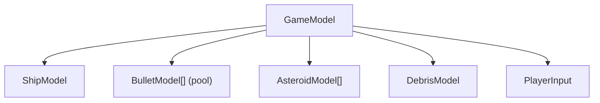
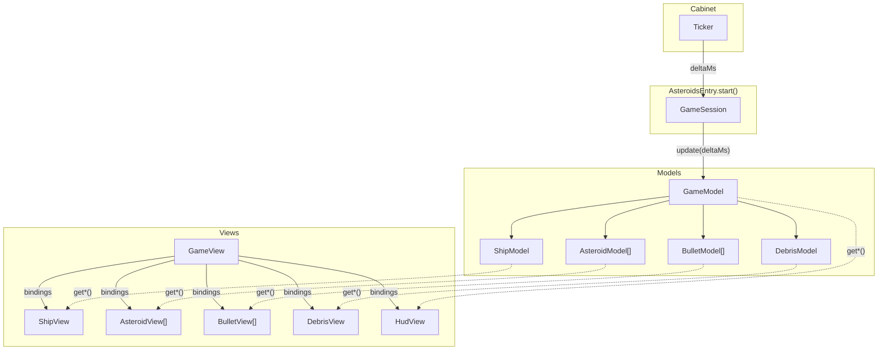

# Walkthrough: Asteroids

> An annotated tour of the Asteroids game module, showing how MVT principles
> apply in a real codebase. Some details here are practical choices specific
> to this project (like the `data/` directory) rather than MVT requirements.

**Previous:** [Bindings](bindings.md) · **Next:** [Next Steps](next-steps.md)

---

## Why Asteroids?

Asteroids is a good first walkthrough because it covers all the core MVT
patterns without too many game-specific complications:

- A root model that composes child models (ship, asteroids, bullets, debris)
- A top-level view that wires bindings for leaf views
- Domain-level world-units (not pixels) in the model layer
- Change detection for dynamic child lists
- A GameEntry/GameSession that plugs into the cabinet

The complete code lives in `src/games/asteroids/`.

## Directory Structure

```
src/games/asteroids/
├── index.ts              Barrel - re-exports createAsteroidsEntry
├── asteroids-entry.ts    GameEntry factory
├── data/
│   ├── index.ts          Barrel - re-exports all constants
│   └── stage-data.ts     Arena dimensions, speeds, timing, scoring
├── models/
│   ├── index.ts          Barrel - re-exports all models and types
│   ├── common.ts         Domain types (RotationDirection, AsteroidSize, GamePhase)
│   ├── player-input.ts   Input state container
│   ├── ship-model.ts     Ship position, rotation, thrust, wrapping
│   ├── bullet-model.ts   Bullet position, lifetime, activation
│   ├── asteroid-model.ts Asteroid position, size, alive state
│   ├── debris-model.ts   Particle explosion/implosion effects
│   └── game-model.ts     Root model - composes all child models
└── views/
    ├── index.ts           Barrel - re-exports createGameView
    ├── game-view.ts       Top-level view - wires all child views
    ├── ship-view.ts       Ship renderer with thrust flame
    ├── bullet-view.ts     Bullet dot renderer
    ├── asteroid-view.ts   Asteroid outline renderer
    ├── debris-view.ts     Particle line renderer
    └── hud-view.ts        Score, lives, wave display
```

The three directories follow MVT's layer separation: `data/` for static
configuration, `models/` for state and logic, `views/` for presentation.

## Shared Constants (`data/`)

The `data/` directory is not an MVT layer - it is simply a convenient place to
collect static constants that both models and views may reference. All game
constants live in `data/stage-data.ts` - arena dimensions, speeds, timing
delays, scoring rules:

```ts
// Arena dimensions in world-units (not pixels)
export const ARENA_WIDTH = 400;
export const ARENA_HEIGHT = 400;

// Ship physics
export const SHIP_ROTATION_SPEED = 5;    // radians per second
export const SHIP_THRUST = 200;          // world-units per second squared
export const SHIP_MAX_SPEED = 250;       // world-units per second
export const SHIP_RADIUS = 10;           // world-units

// Timing
export const WAVE_CLEAR_DELAY_MS = 1500;
export const DYING_DELAY_MS = 1500;
```

Notice: all spatial values are in **world-units**, not pixels. The model doesn't
know or care about screen resolution.

## The Models

### Domain types

`models/common.ts` defines the domain vocabulary using string-literal unions:

```ts
export type RotationDirection = 'left' | 'none' | 'right';
export type AsteroidSize = 'large' | 'medium' | 'small';
export type GamePhase = 'playing' | 'wave-clear' | 'dying' | 'respawning' | 'game-over';
```

No `enum`, no const-object - just unions of string literals, readable in
logs and debugger output.

### A child model: ShipModel

Each child model is a focused, independently testable unit. Here is the ship
model's public interface:

```ts
interface ShipModel {
    readonly x: number;          // world-units
    readonly y: number;          // world-units
    readonly angle: number;      // radians
    readonly vx: number;         // world-units per second
    readonly vy: number;         // world-units per second
    readonly isAlive: boolean;
    readonly isThrusting: boolean;
    setRotationDirection(dir: RotationDirection): void;
    setThrust(on: boolean): void;
    kill(): void;
    respawn(x: number, y: number): void;
    update(deltaMs: number): void;
}
```

The interface describes everything needed in domain terms. Position is in
world-units. Velocity is in world-units per second. No pixel coordinates, no
sprite references - those are the view's problem.

The factory function (`createShipModel`) takes an options object with
arena dimensions, physics constants, and start position. Private state
(current velocity, position) lives in closure scope.

### The root model: GameModel

The game model composes all child models and orchestrates their interactions:

```ts
interface GameModel {
    readonly phase: GamePhase;
    readonly ship: ShipModel;
    readonly asteroids: readonly AsteroidModel[];
    readonly bullets: readonly BulletModel[];
    readonly debris: DebrisModel;
    readonly score: number;
    readonly lives: number;
    readonly wave: number;
    readonly playerInput: PlayerInput;
    reset(): void;
    update(deltaMs: number): void;
}
```

Its `update()` method follows the **advance-then-orchestrate** pattern:

```ts
update(deltaMs: number): void {
    // Advance phase timeline (dying / wave-clear / respawn delays)
    phaseTimeline.time(phaseTimeline.time() + 0.001 * deltaMs);
    debrisModel.update(deltaMs);

    // Advance children
    ship.update(deltaMs);
    for (let i = 0; i < asteroids.length; i++) asteroids[i].update(deltaMs);
    for (let i = 0; i < bullets.length; i++) bullets[i].update(deltaMs);

    // Orchestrate: collision checks, wave clear, etc.
    checkBulletsVsAsteroids();
    checkShipVsAsteroids();

    if (aliveAsteroidCount() === 0) {
        scheduleWaveClear();
    }
}
```

First, all timelines and child models advance unconditionally. Then
orchestration logic checks for collisions, triggers wave transitions, and
handles game-over conditions. The scheduling helpers
(`scheduleWaveClear`, `scheduleDying`, etc.) build GSAP timeline sequences
declaratively - `update()` itself stays short and flat.

### Model hierarchy



Each child model is independently testable. Call `createShipModel()` with
options, feed it `update()` calls, and assert position, angle, and velocity.
The game model tests cross-cutting concerns like collisions and scoring.

## The Views

### A leaf view: ShipView

Leaf views accept bindings and know nothing about the game model:

```ts
interface ShipViewBindings {
    getX(): number;
    getY(): number;
    getAngle(): number;
    isAlive(): boolean;
    isThrusting(): boolean;
}

function createShipView(bindings: ShipViewBindings): Container {
    const view = new Container();
    // ... build graphics at construction ...

    function refresh(): void {
        view.visible = bindings.isAlive();
        view.position.set(bindings.getX(), bindings.getY());
        view.rotation = bindings.getAngle();
        flameGfx.visible = bindings.isThrusting();
    }

    view.onRender = refresh;
    return view;
}
```

### The top-level view: GameView

The game view receives the `GameModel` directly (it's application-specific, not
reusable) and wires bindings for every leaf view:

```ts
function createGameView(game: GameModel): Container {
    const view = new Container();

    // Ship view - wired from game.ship properties
    const shipContainer = createShipView({
        getX: () => game.ship.x,
        getY: () => game.ship.y,
        getAngle: () => game.ship.angle,
        isAlive: () => game.ship.isAlive,
        isThrusting: () => game.ship.isThrusting,
    });
    view.addChild(shipContainer);

    // HUD view - wired from game scoring properties
    const hudContainer = createHudView({
        getScore: () => game.score,
        getLives: () => game.lives,
        getWave: () => game.wave,
        getScreenWidth: () => ARENA_WIDTH,
    });
    view.addChild(hudContainer);

    // Keyboard input - relays user actions to model
    view.addChild(
        createKeyboardInputView({
            onXDirectionChanged: (dir) => {
                game.playerInput.rotationDirection = dir;
            },
            onYDirectionChanged: (dir) => {
                game.playerInput.thrustPressed = dir === 'up';
            },
            onPrimaryButtonChanged: (pressed) => {
                game.playerInput.firePressed = pressed;
            },
        }),
    );

    return view;
}
```

Notice the wiring pattern:
- Each `get*()` binding is an arrow function reading a model property.
- Each `on*()` binding is an arrow function writing to the player input.
- Leaf views don't import the game model - they only see their own bindings.

### Dynamic child views

When the number of asteroids or bullets changes (asteroids split, bullets fire
and expire), the game view uses change detection to rebuild only the affected
view lists:

```ts
const watcher = watch({
    asteroidCount: () => game.asteroids.length,
    bulletCount: () => game.bullets.length,
});

function refresh(): void {
    const watched = watcher.poll();
    if (watched.asteroidCount.changed) buildAsteroids();
    if (watched.bulletCount.changed) buildBullets();
}
```

This is a practical example of change detection - poll every frame, rebuild
only on change. For the full pattern, see
[Change Detection](../guide/change-detection.md).

## The Entry Point

The entry point connects the game to the cabinet using the `GameEntry` and
`GameSession` interfaces:

```ts
function createAsteroidsEntry(): GameEntry {
    return {
        id: 'asteroids',
        name: 'Asteroids',
        screenWidth: ARENA_WIDTH,
        screenHeight: ARENA_HEIGHT + HUD_HEIGHT,

        start(stage: Container): GameSession {
            const gameModel = createGameModel({
                arenaWidth: ARENA_WIDTH,
                arenaHeight: ARENA_HEIGHT,
            });

            const gameView = createGameView(gameModel);
            stage.addChild(gameView);

            return {
                update(deltaMs: number): void {
                    gameModel.update(deltaMs);
                },
                destroy(): void {
                    stage.removeChild(gameView);
                    gameView.destroy({ children: true });
                },
            };
        },
    };
}
```

The `start()` method creates the model and view, mounts the view on the stage,
and returns a `GameSession` with `update()` and `destroy()`. The cabinet's
ticker calls `session.update(deltaMs)` each frame, which flows into
`gameModel.update(deltaMs)`. Pixi's render cycle then triggers the game view's
`refresh()` via `onRender`.

## How It All Fits Together



The model tree and view tree happen to look similar in this game because each
domain entity has a natural visual counterpart. This is common in simple games
but is not a requirement - see
[Model-View Mapping](../guide/view-composition.md#model-view-mapping) for cases
where the trees diverge. The trees are connected by bindings wired in
the top-level game view. Models own state and logic. Views own rendering. The
ticker drives the loop. Each layer does its job and nothing more.

---

**Next:** [Next Steps](next-steps.md)
