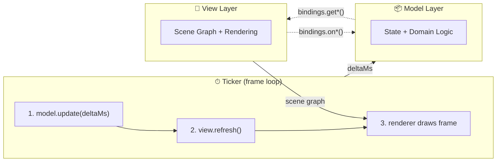
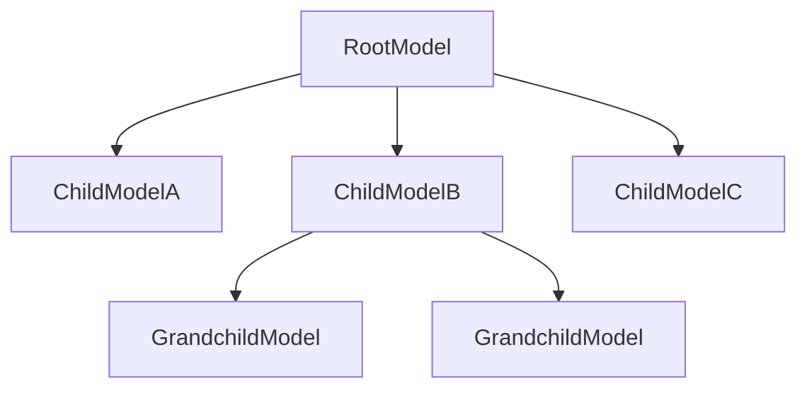
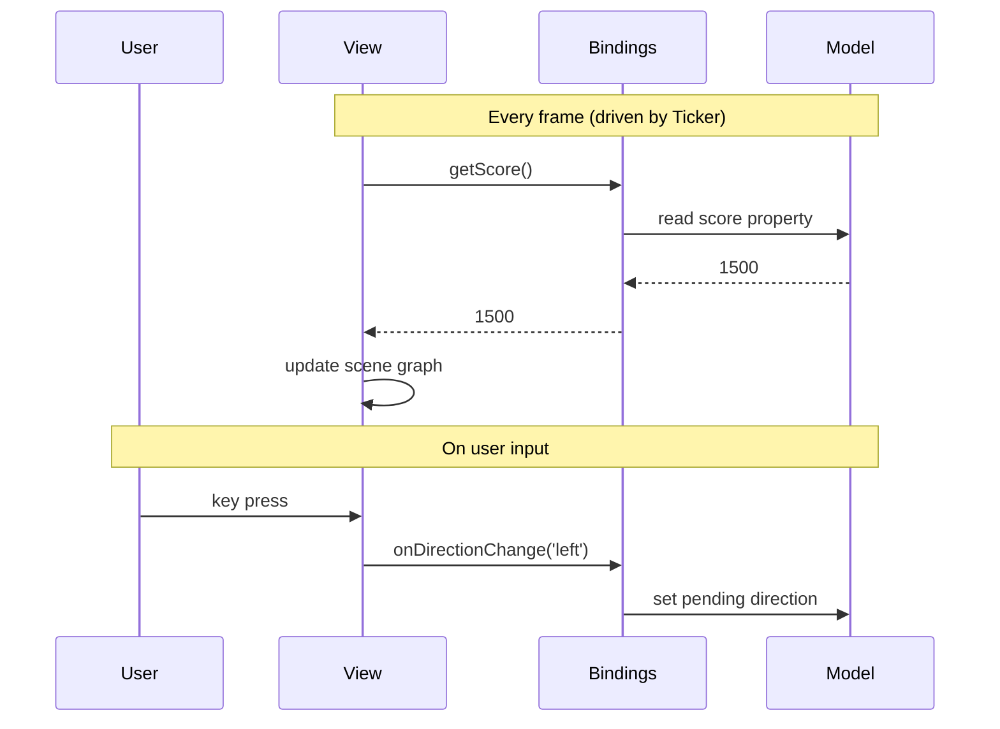
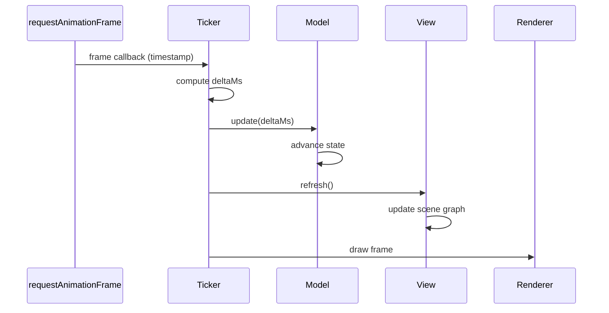

# MVT (Model-View-Ticker) Architecture Guide

An architectural pattern for visual/interactive applications that promotes
separation of concerns, deterministic state, and smooth frame-based animation.

> **Related:** [MVT Foundations](mvt-foundations.md) for the proven patterns
> behind the architecture · [TypeScript Style Guide](style-guide.md) for coding
> conventions · [Documentation Hub](README.md) for glossary and orientation

---

## Table of Contents

- [Overview](#overview)
- [Architecture at a Glance](#architecture-at-a-glance)
- [Models](#models)
    - [Responsibilities](#model-responsibilities)
    - [What Belongs in a Model vs a View](#what-belongs-in-a-model-vs-a-view)
    - [The update(deltaMs) Contract](#the-updatedeltams-contract)
    - [Model Hierarchy and Composition](#model-hierarchy-and-composition)
    - [Time Management](#time-management)
    - [GSAP Timeline Recipe](#gsap-timeline-recipe)
    - [Structuring update() - Advance then Orchestrate](#structuring-update--advance-then-orchestrate)
- [Views](#views)
    - [Responsibilities](#view-responsibilities)
    - [The refresh() Contract](#the-refresh-contract)
    - [The Bindings Pattern](#the-bindings-pattern)
    - [Reactive Bindings](#reactive-bindings)
    - [Change Detection](#change-detection)
    - [Choosing How Views Access State](#choosing-how-views-access-state)
    - [View Hierarchy and Composition](#view-hierarchy-and-composition)
    - [Multiple Views, One Model](#multiple-views-one-model)
- [Ticker](#ticker)
- [Presentation State](#presentation-state)
- [Hot Paths](#hot-paths)
- [Benefits](#benefits)
- [Rules of Thumb](#rules-of-thumb)

---

## Overview

MVT (Model-View-Ticker) structures an application into three layers:

- **Models** own all state and domain logic.
- **Views** render the current state to the screen - nothing more.
- **Ticker** drives the frame loop, advancing models then refreshing views.

The pattern is particularly suited to applications with continuous animation,
frame-based updates, and interactive user input - games, simulations, data
visualisations, and creative-coding projects.

---

## Architecture at a Glance



### Component Summary

| Component  | Owns                                        | Receives                          | Produces                                              | Must Not                                     |
| ---------- | ------------------------------------------- | --------------------------------- | ----------------------------------------------------- | -------------------------------------------- |
| **Model**  | State, domain logic, time-based transitions | `deltaMs` via `update()`          | Readable state (properties, accessors)                | Know about views, use wall-clock time        |
| **View**   | Scene graph arrangement                     | State via `bindings.get*()`       | Visual output, user-input events via `bindings.on*()` | Hold domain state, run autonomous animations |
| **Ticker** | Frame loop, timing                          | `requestAnimationFrame` callbacks | `deltaMs` for models, `refresh` calls for views       | Contain domain logic or rendering code       |

---

## Models

### Model Responsibilities

Models represent the data and logic of the application. They maintain state,
enforce domain rules, and define how the application evolves over time.

**Models should have:**

- An `update(deltaMs)` method that advances state based on elapsed time
- Public accessors for current state (views bind to these)
- Public methods for state transitions that enforce domain rules

**Models should _not_ have:**

- Any knowledge of views or the ticker
- Any rendering or presentation logic
- Any dependency on wall-clock time (see [Time Management](#time-management))

Models can be organised hierarchically - a parent model composes child models,
delegating `update(deltaMs)` calls down the tree. This allows complex domains
to be broken into focused, independently testable units.

### What Belongs in a Model vs a View

The core MVT principle: **models describe _what is happening_ in domain
terms; views describe _how it looks_ on screen.** Anything that could change
if you swapped the renderer (e.g. Pixi.js → terminal, 2D → 3D) belongs in
the view, not the model.

| Concern            | Model                                                             | View                                                                             |
| ------------------ | ----------------------------------------------------------------- | -------------------------------------------------------------------------------- |
| Position           | `row`, `col`, `heading`, world-units                              | Pixel coordinates, screen offsets                                                |
| Speed              | tiles/s, world-units/s                                            | - (derives from model position each frame)                                       |
| Size / extents     | grid cells, world-unit radius                                     | Pixel dimensions, sprite scale                                                   |
| Colours & textures | Named state: `color: 'red'`, `phase: 'inflating'`                 | Actual hex values, texture lookups, tint                                         |
| Animation progress | Sequence order and progress: `inflationStage: 2`, `progress: 0.3` | Sprite frame, alpha tween, particle burst                                        |
| Layout             | Count of items, grid dimensions                                   | Pixel spacing, margins, font size                                                |
| Audio              | Named events: `'pelletEaten'`, `'levelClear'`                     | Sound file, volume, pan                                                          |
| Timing             | Internal timers via `update(deltaMs)`                             | Frame-synced presentation tweens (see [Presentation State](#presentation-state)) |

**Why this split matters:**

- **Presentation independence** - models work unchanged regardless of tile
  size, screen resolution, or rendering technology.
- **Testability** - domain-level tests don't break when visuals change.
- **Clarity** - `row: 5, col: 3` is unambiguous; `x: 60, y: 100` depends
  on knowing the tile size and coordinate origin.

#### In-depth example: coordinates

For grid-based entities that move tile-to-tile, the model exposes **fractional
`row`/`col`** - an integer means "centred on that tile"; a fraction means
"between tiles." Combined with `direction`, this tells the view everything it
needs without pixels ever entering the model's interface.

```ts
interface EntityModel {
    /** Row position - fractional while moving between tiles. */
    readonly row: number;
    /** Column position - fractional while moving between tiles. */
    readonly col: number;
    /** Current movement direction. */
    readonly direction: Direction;
    update(deltaMs: number): void;
}
```

The view converts to pixels:

```ts
// In a leaf view's refresh():
const pixelX = bindings.getCol() * tileSize + tileSize / 2;
const pixelY = bindings.getRow() * tileSize + tileSize / 2;
container.position.set(pixelX, pixelY);
```

Internally, the model may keep separate integer `tileRow`/`tileCol` fields
for tile-level decisions (pathfinding, wall checks, dot eating) while GSAP
tweens the public `row`/`col` between integers - but those are private
implementation details inside the factory closure.

For continuous-space games (e.g. asteroids floating in open space), the same
principle applies: use abstract world-units or normalised 0–1 space, and let
the view apply a scale factor to reach pixels.

#### Signs of presentation leakage

| Smell                                                           | Remedy                                                           |
| --------------------------------------------------------------- | ---------------------------------------------------------------- |
| Properties documented "in pixels"                               | Switch to domain units (grid cells, world-units, normalised 0–1) |
| Velocities in "pixels per second"                               | Express in domain units per second (tiles/s, world-units/s)      |
| Model constants defined in pixel terms (e.g., `CELL_SIZE = 24`) | Define grid counts/slots; let the view compute pixel spacing     |
| Redundant `x`/`y` alongside `row`/`col` on grid entities        | Remove from the interface; let `row`/`col` be fractional         |
| Hex colour values or texture names in model state               | Use named domain states; let the view map to visual assets       |

### The `update(deltaMs)` Contract

Every model exposes an `update(deltaMs)` method. The ticker calls it once per
frame, passing the number of milliseconds since the last frame. This is the
**sole mechanism** by which time flows into a model.

```ts
interface EntityModel {
    readonly row: number;
    readonly col: number;
    readonly direction: Direction;
    update(deltaMs: number): void;
}
```

The contract guarantees:

- **Determinism** - same sequence of `update(deltaMs)` calls → same state.
  Unit tests can replay exact frame sequences.
- **Ticker control** - the ticker can pause, slow down, speed up, or
  single-step time. Models stay in sync because they only ever see `deltaMs`.
- **Consistent snapshots** - between `update()` and `refresh()`, model state
  is stable. No background timer can mutate it mid-frame.

> **No large time leaps.** Model `update()` implementations typically contain
> multi-phase state machines and per-tile GSAP timelines that depend on
> inter-tick transitions. A single `update(5000)` call will _not_ produce the
> same result as 312 × `update(16)` calls, because:
>
> 1. **Early returns after phase changes** - a phase-guarded block may
>    transition to a new phase and then `return`, so the new phase's logic
>    only runs on the _next_ tick.
> 2. **GSAP timelines with callbacks** - a huge time jump can overshoot a
>    timeline's total duration, skipping `set()` / `call()` triggers that
>    schedule the next sequence.
> 3. **Orchestration guards** - patterns like
>    `if (!state.moving) scheduleMove()` depend on intermediate ticks to
>    observe the completed-move flag and enqueue the next one.
>
> When you need to fast-forward a model (e.g. generating thumbnails), always
> step in small increments (~16 ms) to preserve correct behaviour.

### Model Hierarchy and Composition

Complex applications break models into a tree. The root model's `update()`
delegates to child models:



```ts
function createRootModel(): RootModel {
    const childA = createChildModelA();
    const childB = createChildModelB();

    return {
        get score() {
            return childA.score;
        },
        update(deltaMs) {
            childA.update(deltaMs);
            childB.update(deltaMs);
            // ... cross-model logic (e.g., collision detection) ...
        },
    };
}
```

Each child model is independently testable - pass in `update(deltaMs)` calls
directly, assert on public state. The parent model orchestrates them and handles
cross-cutting concerns (collisions, phase transitions, scoring).

### Time Management

> **Critical rule:** Models _must_ only advance state through the `deltaMs`
> parameter. Time may _only_ flow in via `update()` calls.

**Forbidden** (advances state outside the ticker's control):

| Mechanism                          | Why it's forbidden                               |
| ---------------------------------- | ------------------------------------------------ |
| `setTimeout` / `setInterval`       | Fires on wall-clock time, not model time         |
| `requestAnimationFrame`            | Bypasses the ticker's `deltaMs` pipeline         |
| Auto-playing GSAP tweens           | GSAP's global ticker advances them independently |
| `Date.now()` / `performance.now()` | Wall-clock reads create non-determinism          |

**Allowed:** Paused GSAP timelines advanced manually in `update()` (see recipe
below).

### GSAP Timeline Recipe

Using GSAP inside a model is a **convenience, not a requirement**. A model can
advance state with plain arithmetic in `update()` - GSAP simply offers a
concise API for easing, sequencing, and multi-property transitions. The timeline
is a hidden implementation detail inside the factory closure; it is never
exposed on the model's public interface.

When a model needs to tween state over time (smooth movement, oscillations,
sequenced transitions), use a **paused GSAP timeline** advanced manually:

**Step 1 - Create once at construction time:**

```ts
const timeline = gsap.timeline({
    paused: true, // detach from GSAP's global ticker
    autoRemoveChildren: true, // clean up completed tweens automatically
});
```

**Step 2 - Append tweens as transitions are scheduled:**

```ts
function scheduleMove(targetX: number, targetY: number): void {
    timeline.to(
        model,
        {
            x: targetX,
            y: targetY,
            duration: 0.3,
        },
        timeline.time(),
    ); // insert at current playhead

    // update logical state when the tween completes
    timeline.set(model, { state: 'idle' }, timeline.time() + 0.3);
}
```

**Step 3 - Advance in `update()`:**

```ts
update(deltaMs) {
    const deltaSec = deltaMs / 1000;
    timeline.time(timeline.time() + deltaSec);
    // All tweens advance under explicit ticker control
}
```

This gives you the expressiveness of GSAP's timeline API while keeping all state
advancement under the ticker's explicit control. The single long-lived timeline
instance with `autoRemoveChildren` keeps memory tidy without manual cleanup.

### Structuring `update()` - Advance then Orchestrate

When a model uses GSAP timelines, `update()` should follow a strict two-phase
pattern:

1. **Advance** - unconditionally advance every timeline.
2. **Orchestrate** - check current state and trigger new sequences as needed.

`update()` must _not_ contain detailed sequencing logic (manual timer
arithmetic, multi-step state machines). That work belongs in `schedule*()`
helpers that build timeline sequences.

```ts
// ✅ Good - advance + orchestrate
update(deltaMs) {
    const dt = 0.001 * deltaMs;
    moveTimeline.time(moveTimeline.time() + dt);
    attackTimeline.time(attackTimeline.time() + dt);

    // Orchestration: trigger next sequence when idle
    if (!state.moving) scheduleMove();
}

// ❌ Bad - manual sequencing inside update()
update(deltaMs) {
    if (state.phase === 'windup') {
        state.windupTimer -= deltaMs;
        if (state.windupTimer <= 0) {
            state.phase = 'attack';
            state.attackTimer = 500;
        }
    } else if (state.phase === 'attack') {
        state.attackTimer -= deltaMs;
        // ...etc - increasingly tangled branches
    }
}
```

**Why this matters:**

- `schedule*()` helpers describe sequences _declaratively_ using the timeline
  API - durations, easing, callbacks - in one place you can read top-to-bottom.
- `update()` stays short, flat, and easy to audit. Each frame it does the same
  thing: advance clocks, check a few predicates, maybe kick off new sequences.
- Multiple timelines (movement, attack, cooldown) advance independently,
  avoiding nested `if/else` chains that grow with every new behaviour.

---

## Views

### View Responsibilities

Views render the visual representation of the current model state. They are
**stateless** and **timeless** - they don't track what happened before, and they
don't decide what happens next.

**Views should have:**

- A `bindings` object received at construction time
- A `refresh()` function that updates the scene graph to match current state

**Views should _not_ have:**

- Any direct knowledge of models or the ticker
- Any domain state or logic
- Any internally-driven animations or timers
- Any state beyond the current scene graph arrangement

### The `refresh()` Contract

A view's `refresh()` function is called once per frame, after all models have
been updated. It reads current state from `bindings.get*()` accessors and
updates the scene graph to match.

```ts
function createScoreView(bindings: ScoreViewBindings): Container {
    const container = new Container();
    const label = new Text({ text: '0', style: scoreStyle });
    container.addChild(label);

    function refresh(): void {
        label.text = String(bindings.getScore());
    }

    container.onRender = refresh;
    return container;
}
```

Key principles:

- **Reactive** - all binding values a view depends on must be re-read in
  `refresh()`, never cached at construction. See [Reactive Bindings](#reactive-bindings).
- **Minimise work** - only update what changed. Use change detection for
  infrequent changes to avoid unnecessary rebuilds. See
  [Change Detection](#change-detection).
- **No side effects** - `refresh()` reads state and writes to the scene graph.
  It does not mutate models, emit events, or trigger transitions.
- **Idempotent** - calling `refresh()` twice with the same model state produces
  the same visual result.

### The Bindings Pattern

The `bindings` object is the contract between a view and the rest of the
application. It contains two kinds of members:

| Prefix   | Purpose            | Direction    | Example                                   |
| -------- | ------------------ | ------------ | ----------------------------------------- |
| `get*()` | Read current state | Model → View | `getScore(): number`                      |
| `on*()`  | Relay user input   | View → Model | `onDirectionChange(dir: Direction): void` |



**Why bindings?**

- **Decoupling** - the view doesn't know which model (or mock) provides the
  data. Swap implementations freely.
- **Testability** - pass mock bindings returning fixed values; assert the view
  renders correctly without needing a real model.
- **Explicit dependencies** - the bindings type declaration is a complete list
  of everything the view needs. No hidden coupling.

```ts
interface ScoreViewBindings {
    getScore(): number;
    getHighScore(): number;
    onResetClick?(): void;
}
```

The code that constructs both the model and view is responsible for wiring the
bindings - mapping model properties to `get*()` accessors and model methods to
`on*()` handlers.

#### Optional bindings

**`on*()` bindings should usually be optional.** A view emits events for user
input, but the application decides whether and how it responds. Not every
consumer will use every event. For example, a gamepad input view may report direction and fire events,
but a simple game might only care about direction.
Declaring `on*()` members as optional keeps the view usable in more contexts
without forcing callers to supply no-op handlers.

Inside the view, call optional `on*()` bindings with optional chaining:

```ts
interface InputViewBindings {
    onDirectionChange?(dir: Direction): void;
    onFireChange?(pressed: boolean): void;
}

// In the view's event handler:
bindings.onDirectionChange?.(dir);
bindings.onFireChange?.(true);
```

**`get*()` bindings may also be optional**, but only when there is one obvious,
uncontroversial default value. This applies to properties where omission clearly
means "use the standard value" rather than "the caller forgot to provide it."
When a `get*()` binding is optional, the view should document the default and
apply it with a nullish-coalescing fallback:

```ts
interface PanelViewBindings {
    getLabel(): string; // required - no sensible default
    getOpacity?(): number; // optional - defaults to 1 (fully opaque)
    getVisible?(): boolean; // optional - defaults to true
}

// In the view's refresh():
const opacity = bindings.getOpacity?.() ?? 1;
const visible = bindings.getVisible?.() ?? true;
```

When in doubt, keep `get*()` bindings required - a missing accessor is usually
a wiring bug, and TypeScript catching it at the call site is valuable.

### Reactive Bindings

Bindings are **reactive** - their values may change between frames. A view must
never cache a binding's return value at construction time and assume it will
stay the same. Every value a view depends on must be re-evaluated in
`refresh()`, either by calling the binding directly or through change
detection (see below).

```ts
// ❌ Wrong - cached at construction, never re-evaluated
function createBadView(bindings: MyBindings): Container {
    const rows = bindings.getRows(); // frozen forever
    // ...
}

// ✅ Correct - re-evaluated every frame
function createGoodView(bindings: MyBindings): Container {
    const container = new Container();
    // ...
    container.onRender = refresh;
    return container;

    function refresh(): void {
        const rows = bindings.getRows(); // always current
        // ...
    }
}
```

This guarantees that if the model replaces its internal state (e.g., on reset),
the view automatically picks up the new values on the next frame without any
manual notification wiring.

### Change Detection

Re-evaluating every binding every frame is correct but not always efficient.
Some bindings change rarely (dimensions, configuration, phase) while others
change every frame (entity positions). For infrequent changes, **change
detection** provides efficient reactivity: poll every frame, but only act when
the value actually differs.

The simplest approach is manual previous-value tracking:

```ts
let prevScore = -1;

function refresh(): void {
    const score = bindings.getScore();
    if (score !== prevScore) {
        prevScore = score;
        label.text = String(score);
    }
}
```

For views with many watched bindings, a small `Watch<T>` helper can reduce
boilerplate. The example below wraps a getter and tracks changes with `===`
comparison. `changed()` returns a number (`0` or `1`) so that multiple watches
can be combined with bitwise OR without short-circuit evaluation skipping any
polls:

```ts
interface Watch<T> {
    changed(): number; // 1 = changed, 0 = same
    readonly value: T; // most recent value
}

function createWatch<T>(read: () => T): Watch<T> {
    let current = read();
    return {
        changed() {
            const next = read();
            if (next === current) return 0;
            current = next;
            return 1;
        },
        get value() {
            return current;
        },
    };
}
```

Usage:

```ts
const watchRows = createWatch(bindings.getRows);
const watchCols = createWatch(bindings.getCols);

function refresh(): void {
    // Bitwise OR ensures every watch polls - no short-circuit skipping
    if (watchRows.changed() | watchCols.changed()) {
        rebuildGrid();
    }
}
```

Whichever approach you use, the goal is the same: **poll every frame, rebuild
only on change**.

#### When to use change detection

| Situation                                                              | Approach                                                |
| ---------------------------------------------------------------------- | ------------------------------------------------------- |
| Value changes most frames (entity x/y)                                 | Read binding directly - change detection has no benefit |
| Value changes rarely, reaction is cheap (text label)                   | Compare previous value - skip redundant updates         |
| Value change triggers expensive rebuild (scene graph teardown/rebuild) | Essential - avoid rebuilding every frame                |

#### Change detection as consumer-defined events

Another way to think of change detection is as **consumer-defined events**.
Traditional event systems require the producer to decide what constitutes an
event and emit it - consumers must subscribe, unsubscribe, and hope the
producer fires at the right granularity. With change detection, the consumer
defines what matters by choosing which bindings to watch and what to do when
they change. The model doesn't need to know anyone is listening:

```ts
const watchPhase = createWatch(bindings.getGamePhase);

function refresh(): void {
    if (watchPhase.changed()) {
        // This view decided phase transitions matter - the model
        // didn't need an "onPhaseChange" event for this to work.
        rebuildOverlay(watchPhase.value);
    }
}
```

A second view can watch the same binding and react differently - or ignore it
entirely. No event registration, no coupling to the producer's event API, and
no risk of missing or double-handling an event.

### Choosing How Views Access State

Not every view needs a full `get*()`/`on*()` bindings interface. MVT recognises
three access patterns - choose by reuse potential and data-source complexity.

#### Decision criteria

| View kind                                        | Access pattern                                                                              | Rationale                                                                                                                |
| ------------------------------------------------ | ------------------------------------------------------------------------------------------- | ------------------------------------------------------------------------------------------------------------------------ |
| **Top-level application view**                   | Accept model(s) + config directly                                                           | Application-specific by definition; biggest bindings savings; no reuse scenario; eliminates collection verbosity         |
| **Reusable leaf view**                           | `get*()`/`on*()` bindings interface                                                         | Small interface cost; genuine reuse across applications; adapter layer absorbs model-shape mismatches at the wiring site |
| **Static config** (tile size, screen dimensions) | Import from a data module (application-specific) or receive as a plain parameter (reusable) | Never changes at runtime; not reactive state; avoids polluting bindings interfaces                                       |

#### Why top-level views skip bindings

An application's top-level view (the one that orchestrates all sub-views) is the
**least** likely to be reused elsewhere - it exists to wire this application's
specific sub-views together. It is also the view with the **largest** bindings
surface: every property in every collection must be projected through indexed
accessors. Letting it read model properties directly eliminates that entire
layer.

Because the top-level view accesses models directly, it wires sub-view bindings
from model properties without an intermediate bindings interface:

```ts
// Example: a game's top-level view wires sub-views from the model tree
function createGameView(game: GameModel): Container {
    const hudContainer = createHudView({
        getScore: () => game.score.score,
        getLives: () => game.score.lives,
    });

    for (let i = 0; i < game.entities.length; i++) {
        const entity = game.entities[i];
        createEntityView({
            getX: () => entity.x,
            getY: () => entity.y,
        });
    }
}
```

#### Why leaf views use bindings

Smaller, focused views - entity renderers, HUD panels, overlays - are natural
candidates for reuse as the application library grows. The `get*()`/`on*()`
bindings interface gives them an adapter layer: if a model's property is named
`posX` but the view expects `getX()`, only the wiring changes - neither the
model nor the view needs modifying. With direct structural access, one or both
would need to change.

### View Hierarchy and Composition

Like models, views compose hierarchically. A parent view creates child views,
each with its own bindings, and adds them to the scene graph.

The top-level application view typically receives model(s) directly and wires
bindings for each child. Child views know nothing about the model tree - they
only see their own `get*()`/`on*()` bindings:

```ts
// Example: a game's top-level view wires sub-view bindings from the model tree
function createGameView(game: GameModel): Container {
    const container = new Container();

    container.addChild(
        createGridView({
            getRows: () => game.grid.rows,
            getCols: () => game.grid.cols,
            getTileKind: (r, c) => game.grid.tileAt(r, c),
        }),
    );

    container.addChild(
        createHudView({
            getScore: () => game.score.score,
        }),
    );

    container.addChild(
        createKeyboardInputView({
            onDirectionChange: (dir) => {
                game.playerInput.direction = dir;
            },
            onRestartRequest: () => {
                game.playerInput.restartRequested = true;
            },
        }),
    );

    return container;
}
```

Child views are independent - each only knows about the `get*()` and `on*()`
members it needs.

### Multiple Views, One Model

Because models are the single source of truth and views only read state through
bindings, multiple views can project from the same model data and are
guaranteed to be perfectly in sync - without any coordination code between them.

The ticker enforces this: all models update first, then all views refresh. By
the time any view reads a binding, every model has finished advancing. No view
can see a half-updated world, and no view needs to notify another that
something changed.

Consider a game phase property read by both a grid view (which rebuilds tiles
on reset) and an overlay view (which shows a game-over message). The same model
property drives two independent visual responses - no event wiring, no shared
mutable flag, no risk of one view seeing `'playing'` while the other sees
`'game-over'`. Similarly, a shared `getTileSize()` binding can flow to entity,
grid, and HUD views, keeping all visual layers scaled identically.

This extends to different facets of the same event: when an entity consumes a
tile item, the grid view sees the item disappear (via a tile-state binding) and
the HUD sees the score increase (via a score binding) - two views projecting
different consequences of the same model change, always consistent because they
read from the same post-`update()` snapshot.

Adding a new view that reads existing model state requires zero changes to
other views. Wire the bindings, and the new view automatically stays in sync.

---

## Ticker

The ticker drives the application's frame loop. Each frame follows a strict
sequence:



**Implementation notes:**

- Use `requestAnimationFrame` in browser environments for optimal frame pacing.
- Compute `deltaMs` as the difference between the current and previous
  timestamps. Cap it to a maximum (e.g., 100ms) to prevent spiral-of-death
  when the tab was backgrounded.
- The ticker should support **pausing** and **resuming** - when paused, stop
  calling `update()` but optionally continue rendering (e.g., to show a pause
  overlay).
- The ticker contains no domain logic and no rendering code. It is purely a
  timing orchestrator.

---

## Presentation State

In limited cases, a view may maintain internal state for a purely visual
animation. This is the **exception**, not the rule. It applies only when:

1. The model doesn't need to know about the transition to enforce domain rules.
2. The internal state is purely cosmetic and doesn't affect application behaviour.

**Example: Animated score counter**

The model updates `score` in discrete jumps (e.g., 0 → 100 → 250). The view
wants to animate the displayed number smoothly between values:

```
Model state:     0 ──────── 100 ──────────── 250
                     jump          jump

Displayed value: 0 ~~~~ 100 ~~~~ 250
                  smooth    smooth
                  tween     tween
```

The view maintains a `displayedScore` variable and tweens it toward the model's
current score each frame. The model is unaware of this; it only knows the
"real" score.

> **Guideline:** If you find a view's internal state influencing model behaviour
> or growing beyond a single tweened value, it likely belongs in the model
> instead.

---

## Hot Paths

Any code invoked every tick is on a **hot path**. In practice, `update()` in
models and `refresh()` in views are hot-path roots - everything they call is
also hot.

Avoid unnecessary computation and heap allocations on hot paths while keeping
code clear. These are guidelines, not absolute rules - apply them where the
allocation or computation is genuinely per-tick.

### Patterns to Avoid on Hot Paths

| Avoid                                              | Prefer                                          | Why                                       |
| -------------------------------------------------- | ----------------------------------------------- | ----------------------------------------- |
| `array.map()`, `.filter()`, `.slice()`, `[...arr]` | Index-based `for` loop, mutate in place         | Each call allocates a new array           |
| `for...of` on arrays                               | `for (let i = 0; i < arr.length; i++)`          | May allocate an iterator object           |
| Destructuring (`const [a, b] = pair`)              | Direct access (`pair[0]`, `pair[1]`)            | Can allocate intermediate wrappers        |
| Template-string keys (`` `${r},${c}` ``)           | Arithmetic encoding (`r * cols + c`)            | Allocates a new string every call         |
| `Map<string, T>` / `Set<string>` for grids         | Flat `T[]` indexed by `row * cols + col`        | Avoids hashing and string allocation      |
| Inline closures in hot functions                   | Hoisted functions or pre-bound references       | Each call allocates a new function object |
| `Object.keys()` / `.values()` / `.entries()`       | Direct property access or pre-cached key lists  | Each call allocates a new array           |
| `Math.sqrt` for distance comparison                | Distance-squared comparison                     | Cheaper arithmetic, same ordering         |
| Redundant recomputation                            | Cache previous values, early-out when unchanged | Skip work that produces the same result   |
| Returning `[row, col]` tuples                      | Out-parameters or pre-allocated result objects  | Avoids per-call array allocation          |

### Quick Test

> "Does this line allocate a new object, array, string, or closure, and is it
> called every frame?" - if yes, consider refactoring.

---

## Benefits

| Concern                    | How MVT Addresses It                                                                                                                                             |
| -------------------------- | ---------------------------------------------------------------------------------------------------------------------------------------------------------------- |
| **Separation of concerns** | Models own state, views own presentation, ticker owns timing. No layer reaches into another.                                                                     |
| **Testability**            | Models are deterministic - replay `update()` calls and assert state. Views accept mock bindings - assert rendering without real models.                          |
| **Scalability**            | Hierarchical models and views compose naturally. Add new features as new model/view pairs without touching existing ones.                                        |
| **Performance**            | A single ticker loop ensures consistent frame pacing. Hot-path guidelines prevent per-tick waste.                                                                |
| **Debugging**              | Deterministic models can be stepped frame-by-frame. No hidden timers or async state mutations to chase.                                                          |
| **Flexibility**            | The ticker can pause, slow-mo, fast-forward, or record/replay. Models don't care - they only see `deltaMs`.                                                      |
| **Multi-view consistency** | Multiple views can project from the same model state, guaranteed in sync - the ticker updates all models before any view refreshes. No coordination code needed. |

---

## Rules of Thumb

A quick checklist for working in an MVT codebase:

1. **Models own time.** All state advances through `update(deltaMs)`. If it
   doesn't flow through `update`, it doesn't happen.
2. **Views are stateless mirrors.** They reflect current model state, period.
   When in doubt, put the state in the model.
3. **Bindings are the bridge.** `get*()` reads state, `on*()` relays input.
   Top-level application views may access models directly (they're
   application-specific and never reused); reusable leaf views should use
   bindings to stay decoupled.
4. **One frame, one sequence.** Ticker calls `update()` then `refresh()` then
   renders. Never interleave or skip steps.
5. **No hidden time.** No `setTimeout`, `setInterval`, auto-playing tweens, or
   `Date.now()` in models. Use paused GSAP timelines advanced in `update()`.
6. **Test in isolation.** Models without views; views with mock bindings.
   If something is hard to test in isolation, the boundaries may need adjusting.
7. **Hot paths stay lean.** `update()` and `refresh()` run ~60 times per
   second. Avoid per-tick allocations; prefer indexed loops and pre-allocated
   structures.
8. **Bindings are reactive.** Never cache a binding's value at construction.
   Re-read in `refresh()`, either directly or via change detection.
9. **Detect infrequent changes.** When a binding changes rarely but triggers
   expensive work, compare against the previous value and rebuild only on
   change.
