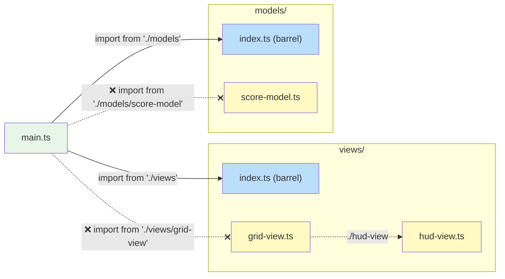

# Project Structure

> Directory layout, module conventions, and barrel file rules for this
> codebase. These are organisational choices specific to this project, not
> MVT architectural requirements.

**Related:** [Style Guide](style-guide.md) · [Architecture Rules](architecture-rules.md) ·
[Adding a Game](../topics/adding-a-game.md)

---

## Directory Layout

Every directory under `src/` is a **module** with a specific responsibility.
Each module has a barrel file (`index.ts`) that defines its public API.

```
src/
├── main.ts              Bootstrap: init Pixi app, create cabinet, start ticker
├── cabinet/             Cabinet model & view (game selection)
├── games/               Game registry + per-game modules
│   ├── game-entry.ts    GameEntry & GameSession interfaces
│   └── <name>/          Self-contained game module
│       ├── data/        Static data and configuration constants
│       ├── models/      State and domain logic + domain types
│       └── views/       Rendering and user-input handling
└── common/              Shared helpers, views, and models
```

| Directory | Contains                                                  | Typical Exports                                           |
| --------- | --------------------------------------------------------- | --------------------------------------------------------- |
| `data/`   | Constants, configuration, static datasets                 | Data objects, lookup tables                               |
| `models/` | Model interfaces, options types, factory functions, domain types | `ScoreModel`, `createScoreModel`, `Direction`, `TileKind` |
| `views/`  | View factory functions, bindings interfaces               | `createHudView`, `HudViewBindings`                        |
| `common/` | Shared helpers, views, and models                         | `createWatch`, `Watch`, `createKeyboardPlayerInputView`   |

::: info Data directories are not MVT layers
Game modules typically include a `data/` directory for static constants (arena
dimensions, speeds, timing values). This is a practical organisational choice,
not an MVT architectural layer. MVT has three layers: model, view, and ticker.
:::

## Barrel Files

Every directory under `src/` provides a barrel file (`index.ts`) that defines
its public API. This is the backbone of the project's module system.

### Why Barrel Files Matter

Barrel files solve four problems that arise as a codebase scales:

1. **Clear module boundaries.** The barrel is the only entry point into a
   directory. Consumers import from the barrel, never from internal files.
   This makes the boundary between "public API" and "implementation detail"
   explicit and checkable.

2. **Internal structure hiding.** Files inside a module can be renamed, split,
   merged, or reorganised without breaking any consumer. Only the barrel's
   re-exports are the contract. Today's single-file helper can become a
   multi-file directory tomorrow - the barrel absorbs the change.

3. **Smooth scaling from files to directories.** A module can start life as a
   single `.ts` file. When it grows, it becomes a directory with an
   `index.ts` barrel. Consumer import paths stay the same (`'./models'`
   resolves to either `models.ts` or `models/index.ts`). This low friction
   encourages splitting at the right time rather than too late.

4. **Circular reference avoidance.** With barrels as the only cross-module
   entry point, dependency cycles are easier to spot and prevent. The rules
   below (no declarations in barrels, no self-imports) eliminate the most
   common source of accidental cycles.

This is enforced by the `import/no-internal-modules` ESLint rule.

### Import Rules

- All imports from **outside** a directory must go through the barrel - never
  reach past it into individual files.
- Imports **within** the same directory use direct relative paths (`./foo`).
- **Never include `.ts` extensions** in module specifiers - write `'./foo'`,
  not `'./foo.ts'`. The importer should not know or care whether a module
  resolves to a file or a directory (this supports smooth scaling).



```ts
// ✅ Correct - importing from the barrel
import { createScoreModel } from './models';
import type { Direction } from '../models';

// ❌ Wrong - reaching past the barrel into a specific file
import { createScoreModel } from './models/score-model';
import type { Direction } from '../models/common';
```

### Barrel File Contents

Barrel files contain **only re-exports** - no declarations, no logic, no side
effects.

```ts
// index.ts - ✅ correct: re-exports only
export { createCounterModel } from './counter-model';
export type { CounterModel, CounterModelOptions } from './counter-model';
export { createTimerModel } from './timer-model';
export type { TimerModel } from './timer-model';
```

```ts
// index.ts - ❌ wrong: barrel contains a declaration
export function createFooEntry(): FooEntry {
    /* ... */
}
export { createHelperModel } from './helper-model';
```

Move declarations into their own file and re-export them:

```ts
// foo-entry.ts          ← declaration lives here
export function createFooEntry(): FooEntry {
    /* ... */
}

// index.ts              ← barrel re-exports it
export { createFooEntry } from './foo-entry';
```

**Why no declarations in barrels?**

- **Locatability** - every directory has an `index.ts`, so definitions there
  are hard to find. A dedicated file gives the definition a clear, searchable
  name.
- **Cyclic-import safety** - when a barrel both declares code and re-exports
  sibling modules, those siblings may try to import the barrel-declared
  symbol, creating a cycle. Keeping barrels declaration-free eliminates this
  risk.

### No Self-Imports Through the Barrel

Files inside a directory must **never** import from their own barrel. Always
use direct relative paths to the sibling file:

```ts
// Inside models/score-model.ts

// ✅ Correct - direct relative import to sibling
import { type Direction } from './common';

// ❌ Wrong - importing from own barrel creates a cycle
import { type Direction } from '.'; // resolves to ./index.ts
import { type Direction } from './index'; // same problem, explicit
```

Importing from your own barrel creates a circular dependency: the barrel
re-exports you, and you import from the barrel. Even when the cycle is
technically resolvable, it makes the dependency graph harder to reason about
and can cause runtime issues where an imported value is `undefined` because
the exporting module has not finished initializing.

## Game Module Structure

Each game is a self-contained module under `src/games/<name>/`. A typical
layout:

```
src/games/<name>/
├── index.ts              Barrel - re-exports createXxxEntry
├── <name>-entry.ts       GameEntry factory
├── data/
│   ├── index.ts          Barrel - re-exports shared game constants
│   └── constants.ts      Shared game constants (used by both models and views)
├── models/
│   ├── index.ts          Barrel - re-exports all models, types, and model constants
│   ├── model-constants.ts  Model-only constants (physics, scoring, timing)
│   ├── common.ts         Domain types (directions, entity kinds, phases)
│   └── game-model.ts     Root model - composes all child models
└── views/
    ├── index.ts           Barrel - re-exports createGameView and view constants
    ├── view-constants.ts  View-only constants (pixel sizes, HUD layout)
    └── game-view.ts       Top-level view - wires all child views
```

For details on creating a new game module, see
[Adding a Game](../topics/adding-a-game.md).
