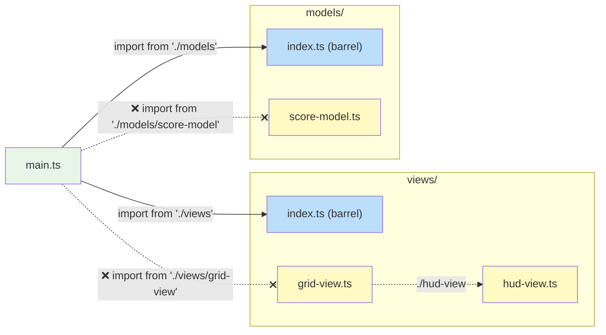

# TypeScript Style Guide

Coding conventions, naming rules, and project structure for this codebase.

> **Related:** [MVT Architecture Guide](mvt-guide.md) for the architectural
> pattern · [Documentation Hub](README.md) for glossary and orientation

---

## Table of Contents

- [Quick Reference](#quick-reference)
- [Naming Conventions](#naming-conventions)
- [File Naming](#file-naming)
- [Formatting](#formatting)
- [Project Structure](#project-structure)
- [Modules and Barrel Files](#modules-and-barrel-files)
- [Enumeration Types](#enumeration-types)
- [Models](#models)
- [Views](#views)
- [Code Organisation](#code-organisation)

---

## Quick Reference

| Convention | Example | Section |
|-----------|---------|---------|
| File names | `score-model.ts` | [File Naming](#file-naming) |
| Types / interfaces | `ScoreModel`, `TileKind` | [Naming Conventions](#naming-conventions) |
| Functions / variables | `createScoreModel`, `deltaMs` | [Naming Conventions](#naming-conventions) |
| Factory functions | `createXxxModel(options)` | [Models](#models) |
| Binding accessors | `getScore()`, `onResetClick()` | [Views](#views) |
| Enum-like types | `type TileKind = 'wall' \| 'empty'` | [Enumeration Types](#enumeration-types) |
| Barrel imports | `import { Foo } from './module'` | [Modules and Barrel Files](#modules-and-barrel-files) |
| Module specifiers | `'./foo'` not `'./foo.ts'` | [Modules and Barrel Files](#modules-and-barrel-files) |
| Indentation | 4 spaces | [Formatting](#formatting) |
| Unused parameters | `_deltaMs` | [Naming Conventions](#naming-conventions) |

---

## Naming Conventions

All naming rules collected in one place for easy reference.

| Element | Convention | Example |
|---------|-----------|---------|
| Files | `lower-kebab-case.ts` | `score-model.ts`, `tile-kind.ts` |
| Types / Interfaces | `PascalCase` | `ScoreModel`, `GameViewBindings` |
| Model types | Suffix with `Model` | `ScoreModel`, `PlayerInputModel` |
| View types | Suffix with `View` | `MazeView`, `KeyboardPlayerInputView` |
| Functions / Variables | `camelCase` | `createScoreModel`, `deltaMs` |
| Factory functions | `create` + `PascalCase` noun | `createScoreModel`, `createHudView` |
| Binding accessors | `get` + description | `getScore()`, `getEntityX()` |
| Binding event handlers | `on` + description | `onDirectionChange()`, `onResetClick()` |
| Enum-like type names | Use `Kind`, not `Type` | `TileKind` ✅ · `TileType` ❌ |
| Unused parameters | `_` prefix | `update(_deltaMs: number)` |

**Why `Kind` over `Type`?** — The word "type" is heavily overloaded in
TypeScript (`type` keyword, `typeof`, type parameters). Using `Kind` avoids
ambiguity in both code and conversation.

---

## File Naming

- All file names use `lower-kebab-case.ts`.

```
score-model.ts    ✅
ScoreModel.ts     ❌
scoreModel.ts     ❌
score_model.ts    ❌
```

---

## Formatting

- Use **4 spaces** for indentation (no tabs).
- Formatting is enforced by Prettier — run `npm run format` to auto-fix, or
  `npm run format:check` to verify.

---

## Project Structure

Every directory under `src/` is a **module** with a specific responsibility.
Each module has a barrel file (`index.ts`) that defines its public API.

```
src/
├── main.ts          Entry point — bootstraps app, wires models ↔ views, starts ticker
├── data/            Static data and configuration constants
├── models/          State and domain logic + shared domain types
├── utils/           General helpers (e.g. change-detection watches)
└── views/           Rendering and user-input handling
```

| Directory | Contains | Typical Exports |
|-----------|----------|------------------|
| `data/` | Constants, configuration, static datasets | Data objects, lookup tables |
| `models/` | Model interfaces, options types, factory functions, domain types | `ScoreModel`, `createScoreModel`, `Direction`, `TileKind` |
| `utils/` | General helpers | `createWatch`, `Watch` |
| `views/` | View factory functions, bindings interfaces | `createHudView`, `HudViewBindings` |

---

## Modules and Barrel Files

- Every directory under `src/` must provide a barrel file (`index.ts`).
- All imports from **outside** a directory must go through the barrel — never
  reach past it into individual files.
- Imports **within** the same directory use direct relative paths (`./foo`).
- **Never include `.ts` extensions** in module specifiers — write `'./foo'`, not
  `'./foo.ts'`. The importer should not know or care whether a module resolves
  to a file or a directory; that detail can change without breaking the import.
- A barrel file defines the **public API** of the module. Internal-only files
  should not be re-exported.
- This is enforced by the `import/no-internal-modules` ESLint rule.



```ts
// ✅ Correct — importing from the barrel
import { createScoreModel } from './models';
import type { Direction } from '../models';

// ❌ Wrong — reaching past the barrel into a specific file
import { createScoreModel } from './models/score-model';
import type { Direction } from '../models/common';
```

### Barrel File Contents

Barrel files (`index.ts`) contain only re-exports — no logic, no side effects.
They define which symbols are part of the module's public API:

```ts
// index.ts
export { createCounterModel } from './counter-model';
export type { CounterModel, CounterModelOptions } from './counter-model';
export { createTimerModel } from './timer-model';
export type { TimerModel } from './timer-model';
```

Internal-only files (helpers, constants used only within the module) are **not**
re-exported. This keeps the public surface intentional — consumers can only
depend on what you explicitly choose to expose.

**Why barrel files?**

- **Encapsulation** — internal implementation files can be renamed, split, or
  restructured without breaking consumers. Only the barrel's exports are the
  contract.
- **Discoverability** — one file lists everything a module offers. No need to
  hunt through individual files.
- **Enforceability** — the `import/no-internal-modules` ESLint rule makes this
  a hard constraint, not just a guideline.

---

## Enumeration Types

- Use **unions of string literals** rather than const-object "enum" patterns or
  TypeScript `enum` declarations.
- Use `Kind` in type names, not `Type`.

```ts
// ✅ Preferred — string-literal union
type TileKind = 'empty' | 'wall' | 'dot' | 'spawn-point';

// ❌ Avoid — const-object enum pattern
const TileType = { Empty: 0, Wall: 1, Dot: 2 } as const;
type TileType = (typeof TileType)[keyof typeof TileType];

// ❌ Avoid — TypeScript enum
enum TileType { Empty, Wall, Dot }
```

**Why string literals?**

- Simple and type-safe
- Self-documenting in logs and debugger output (`'wall'` vs `1`)
- Work naturally with `switch` statements and discriminated unions

---

## Models

- Define each model as a **pure interface** describing its public API.
- Expose a **factory function** (`createXxx`) that accepts an options object and
  returns an instance of the interface type.
- Implement models as **plain records** satisfying the interface. Use closure
  scope for private state — no classes.
- Include an `update(deltaMs)` method for time-based state advancement (see
  [MVT Guide — Models](mvt-guide.md#models)).

```ts
// ---------------------------------------------------------------------------
// Interface
// ---------------------------------------------------------------------------

interface CounterModel {
    readonly count: number;
    readonly rate: number;
    increment(): void;
    update(deltaMs: number): void;
}

// ---------------------------------------------------------------------------
// Options
// ---------------------------------------------------------------------------

interface CounterModelOptions {
    readonly initialCount?: number;
    readonly rate?: number;
}

// ---------------------------------------------------------------------------
// Factory
// ---------------------------------------------------------------------------

function createCounterModel(options: CounterModelOptions = {}): CounterModel {
    const { initialCount = 0, rate = 1 } = options;
    let elapsed = 0;

    const model: CounterModel = {
        count: initialCount,
        rate,
        increment() {
            (model as { count: number }).count += 1;
        },
        update(deltaMs) {
            elapsed += deltaMs;
            // ... time-based logic using elapsed ...
        },
    };

    return model;
}
```

Key points:

- The **interface** is the public contract — this is what gets exported and
  referenced by other code.
- The **options object** makes factories extensible without breaking call sites.
- **Private state** (`elapsed`) lives in the closure, invisible to consumers.
- **`readonly` properties** signal "read from outside, mutate only from within."

---

## Views

- Expose each view as a **factory function** that accepts a `bindings` object
  and returns a Pixi.js `Container`.
- No view properties or methods need to be exposed beyond what `Container`
  already provides.
- Use Pixi's `onRender` property to schedule the internal `refresh` function —
  set it once at construction time so rendering is automatic.

```ts
// ---------------------------------------------------------------------------
// Bindings
// ---------------------------------------------------------------------------

interface HudViewBindings {
    getScore(): number;
    getHighScore(): number;
    getLives(): number;
    onResetClick(): void;
}

// ---------------------------------------------------------------------------
// Factory
// ---------------------------------------------------------------------------

function createHudView(bindings: HudViewBindings): Container {
    const container = new Container();

    const scoreLabel = new Text({ text: '0', style: labelStyle });
    container.addChild(scoreLabel);

    // ... build rest of scene graph ...

    function refresh(): void {
        scoreLabel.text = String(bindings.getScore());
        // ... update other display objects from bindings ...
    }

    container.onRender = refresh;
    return container;
}
```

Key points:

- The **bindings interface** is a complete manifest of everything the view needs.
  `get*()` for reading state, `on*()` for relaying user input.
- **`refresh()`** is internal — it's called automatically by the renderer via
  `onRender`, not exposed publicly.
- The view creates the scene graph once at construction time, then updates it
  incrementally in `refresh()`.

---

## Code Organisation

### File Sections

Each model or view file follows a consistent internal structure using section
dividers for navigability:

```ts
// ---------------------------------------------------------------------------
// Interface
// ---------------------------------------------------------------------------

// Public interface definition

// ---------------------------------------------------------------------------
// Options (if needed)
// ---------------------------------------------------------------------------

// Options type for the factory function

// ---------------------------------------------------------------------------
// Factory
// ---------------------------------------------------------------------------

// createXxx() factory function implementation
```

The ordering is deliberate — readers see the **public contract** first
(interface), then the **configuration surface** (options), then the
**implementation** (factory).


