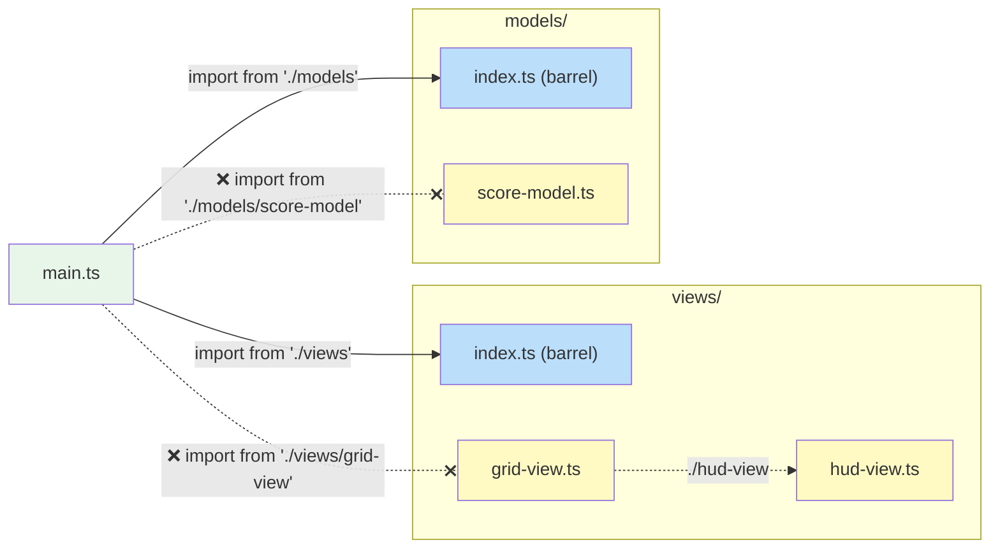

# Project Structure

> Directory layout, module conventions, and barrel file rules for this
> codebase. These are organisational choices specific to this project, not
> MVT architectural requirements.

**Related:** [Style Guide](style-guide.md) · [Architecture Rules](architecture-rules.md)

---

## Directory Layout

The repository is an npm workspace: four libraries, published under the
`@mvtjs` npm scope, and private packages for the website, the docs, the
benchmarks and the checks.

```
packages/
├── utils/               @mvtjs/utils: renderer-agnostic helpers (the tick API, watch, SlotList, tweens); JSX base at ./jsx
├── pixi/                @mvtjs/pixi: the tick API for Pixi containers, performance metrics, and Pixi's JSX runtime
├── three/               @mvtjs/three: the tick API for three.js objects, pointer picker, and its JSX runtime
├── html/                @mvtjs/html: the tick API for DOM elements, and its JSX runtime
├── eslint-plugin/       @mvtjs/eslint-plugin (private for now): this repo's lint rules
├── benchmarks/          @mvtjs/benchmarks (private): performance benchmarks, for the libraries and the games alike
├── docs/                @mvtjs/docs (private): this documentation (VitePress)
└── website/             @mvtjs/website (private): the games, demos and playground, one Vite site of several pages
checks/                  Tests that the packages still fit together as decided
notes/                   Proposals and tasks
```

Each package's source is in its own `src/`. The site's is laid out by area:

```
packages/website/src/
├── main.ts              Bootstrap: init Pixi app, create cabinet, start ticker
├── cabinet/             Cabinet model & view (game selection)
├── games/               Game registry + per-game modules
│   ├── game-entry.ts    GameEntry & GameSession interfaces
│   └── <name>/          Self-contained game module
│       ├── data/        Static data and configuration constants
│       ├── models/      State and domain logic + domain types
│       └── views/       Rendering and user-input handling
├── demos/               Demo registry + per-demo modules
├── playground/          The in-browser editor and the sandbox it runs code in
└── shared/              The site's shared views (overlay, input, pause menu, perfmon), imported as `#shared`
```

Every directory under a package's `src/` is a **module** with a specific
responsibility. Each module has a barrel file (`index.ts`) that defines its
public API.

| Directory | Contains                                                  | Typical Exports                                           |
| --------- | --------------------------------------------------------- | --------------------------------------------------------- |
| `data/`   | Constants, configuration, static datasets                 | Data objects, lookup tables                               |
| `models/` | Model interfaces, options types, factory functions, domain types | `ScoreModel`, `createScoreModel`, `Direction`, `TileKind` |
| `views/`  | View functions, bindings interfaces                       | `HudView`, `HudViewBindings`                              |
| `packages/utils/src/` | Renderer-agnostic helpers and models          | `watch`, `memoiseLast`, `createSlotList`, `createSequence`, `assert` |
| `packages/website/src/shared/` | The site's shared views                          | `OverlayView`, `KeyboardInputView`, `PerfmonView`             |

::: info Data directories are not MVT layers
Game modules typically include a `data/` directory for static constants (arena
dimensions, speeds, timing values). This is a practical organisational choice,
not an MVT architectural layer. MVT has three layers: model, view, and ticker.
:::

## Barrel Files

Every directory under a package's `src/` provides a barrel file (`index.ts`)
that defines its public API. This is the backbone of the project's module
system. Between packages, a package's `exports` field plays the same part:
other packages import `@mvtjs/pixi` or `@mvtjs/utils/jsx`, never a file inside
it.

### Why Barrel Files Matter

Barrel files solve four problems that arise as a codebase scales:

1. **Clear module boundaries.** The barrel is the only entry point into a
   directory. Consumers import from the barrel, never from internal files.
   This makes the boundary between "public API" and "implementation detail"
   explicit and checkable.

2. **Internal structure hiding.** Files inside a module can be renamed, split,
   merged, or reorganised without breaking any consumer. Only the barrel's
   re-exports are the contract. Today's single-file helper can become a
   multi-file directory tomorrow - the barrel absorbs the change.

3. **Smooth scaling from files to directories.** A module can start life as a
   single `.ts` file. When it grows, it becomes a directory with an
   `index.ts` barrel. Consumer import paths stay the same (`'./models'`
   resolves to either `models.ts` or `models/index.ts`). This low friction
   encourages splitting at the right time rather than too late.

4. **Circular reference avoidance.** With barrels as the only cross-module
   entry point, dependency cycles are easier to spot and prevent. The rules
   below (no declarations in barrels, no self-imports) eliminate the most
   common source of accidental cycles.

This is enforced by ESLint: `import/no-internal-modules` for reaching past
a barrel, and `no-restricted-imports` for the self-imports below.

### Import Rules

- All imports from **outside** a directory must go through the barrel - never
  reach past it into individual files.
- Imports **within** the same directory use direct relative paths (`./foo`).
- **Never include `.ts` extensions** in module specifiers - write `'./foo'`,
  not `'./foo.ts'`. The importer should not know or care whether a module
  resolves to a file or a directory (this supports smooth scaling).



```ts
// ✅ Correct - importing from the barrel
import { createScoreModel } from './models';
import type { Direction } from '../models';

// ❌ Wrong - reaching past the barrel into a specific file
import { createScoreModel } from './models/score-model';
import type { Direction } from '../models/common';
```

### Barrel File Contents

Barrel files contain **only re-exports** - no declarations, no logic, no side
effects.

```ts
// index.ts - ✅ correct: re-exports only
export { createCounterModel } from './counter-model';
export type { CounterModel, CounterModelOptions } from './counter-model';
export { createTimerModel } from './timer-model';
export type { TimerModel } from './timer-model';
```

```ts
// index.ts - ❌ wrong: barrel contains a declaration
export function createFooEntry(): FooEntry {
    /* ... */
}
export { createHelperModel } from './helper-model';
```

Move declarations into their own file and re-export them:

```ts
// foo-entry.ts          ← declaration lives here
export function createFooEntry(): FooEntry {
    /* ... */
}

// index.ts              ← barrel re-exports it
export { createFooEntry } from './foo-entry';
```

**Why no declarations in barrels?**

- **Locatability** - every directory has an `index.ts`, so definitions there
  are hard to find. A dedicated file gives the definition a clear, searchable
  name.
- **Cyclic-import safety** - when a barrel both declares code and re-exports
  sibling modules, those siblings may try to import the barrel-declared
  symbol, creating a cycle. Keeping barrels declaration-free eliminates this
  risk.

### No Self-Imports Through the Barrel

Files inside a directory must **never** import from their own barrel. Always
use direct relative paths to the sibling file:

```ts
// Inside models/score-model.ts

// ✅ Correct - direct relative import to sibling
import { type Direction } from './common';

// ❌ Wrong - importing from own barrel creates a cycle
import { type Direction } from '.'; // resolves to ./index.ts
import { type Direction } from './index'; // same problem, explicit
```

This applies at **any** depth, not just to files sitting directly beside the
barrel. A file in a subdirectory is still inside the module, so reaching up to
an ancestor barrel is the same violation:

```ts
// Inside models/helpers/clamp.ts

// ❌ Wrong - ancestor barrel, still a self-import
import { type Direction } from '..';
import { type Direction } from '../index';

// ✅ Correct - the ancestor's file, directly
import { type Direction } from '../common';
```

A file in a subdirectory is inside its ancestors' modules, so it imports what
it needs from them as a sibling would: the file directly. The JSX support
under each renderer does this (`packages/html/src/jsx/` imports
`'../element-mixin'`). Another module's public API is reached through its
barrel, never past it.

Importing from your own barrel creates a circular dependency: the barrel
re-exports you, and you import from the barrel. Even when the cycle is
technically resolvable, it makes the dependency graph harder to reason about
and can cause runtime issues where an imported value is `undefined` because
the exporting module has not finished initializing.

## Between Packages

The rules above apply inside each package. Between packages:

- **Import a package by name**: `@mvtjs/pixi` or `@mvtjs/utils/jsx`, never a
  path into it. Its `exports` field lists what can be reached, as a barrel
  does for a directory. Inside the repo these names resolve to the package's
  `src/`, through an `@mvtjs/source` export condition that TypeScript, Vite,
  Vitest and the benchmarks all set, so nothing needs building first.
- **Declare what you import.** Every import names a dependency of the nearest
  `package.json`. npm hoists packages to the root `node_modules`, so an
  undeclared import still works here, then fails for whoever installs the
  package. ESLint's `import/no-extraneous-dependencies` reports it. Tests,
  scripts and config files may import `devDependencies`; other code may not.
- **Import the tick API from your renderer package.** Each renderer package
  re-exports the names it shares with `@mvtjs/utils`: `updateView`,
  `refreshView`, `setUpdate`, `setRefresh`, `SKIP_DESCENDANTS`, `hasUpdate`,
  `hasRefresh`, the tick counter, and the method types. The site and the
  benchmarks import them from the renderer they use, so each name has one
  place to come from, and the import also loads the renderer, which
  registers its views (`no-restricted-imports`). They are the same functions
  in every renderer package, so code that uses two renderers imports them
  from either.
  `@mvtjs/utils` is imported directly for its helpers: `watch`, tweens,
  sequences, slot lists.
- **The playground stands alone.** `packages/website/src/playground/` and the rest of the
  site share no code in either direction (`import/no-restricted-paths`), so
  the playground could become a package of its own.

Within the site, its shared views are imported as `#shared`, an alias that
`packages/website/package.json` defines.

## Game Module Structure

Each game is a self-contained module under `packages/website/src/games/<name>/`. A
typical layout:

```
packages/website/src/games/<name>/
├── index.ts              Barrel - re-exports createXxxEntry
├── <name>-entry.ts       GameEntry factory
├── data/
│   ├── index.ts          Barrel - re-exports shared game constants
│   └── constants.ts      Shared game constants (used by both models and views)
├── models/
│   ├── index.ts          Barrel - re-exports all models, types, and model constants
│   ├── model-constants.ts  Model-only constants (physics, scoring, timing)
│   ├── common.ts         Domain types (directions, kinds of game object, phases)
│   └── game-model.ts     Root model - composes all child models
└── views/
    ├── index.ts           Barrel - re-exports GameView and view constants
    ├── view-constants.ts  View-only constants (pixel sizes, HUD layout)
    └── game-view.ts       Top-level view - wires all child views (.tsx if its body is JSX)
```

For details on creating a new game module, see
`packages/website/src/games/README.md` in the repository.
