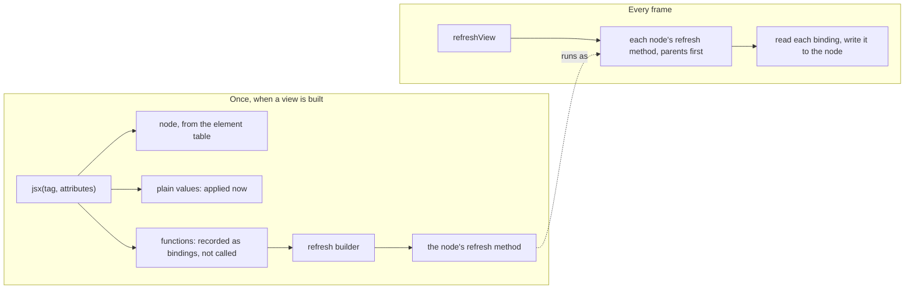

# The JSX base

> How this repo's JSX runtime works, for anyone adding JSX support for a new
> renderer or changing the runtime itself. It starts from what a JSX tag
> becomes, and builds up to how refresh methods are made fast. You don't need
> this to write views with JSX: see
> [Presenting the World](../../../docs/building-with-mvt/presenting-the-world/views.md).
> [The design notes](./design-notes.md) explain why the runtime is built this
> way, and what was tried instead.

---

## What it is

A JSX runtime that renders once. Each tag builds its node once and never
rebuilds it. An attribute given a plain value is applied when the node is
built. An attribute given a function is a **binding**: the runtime reads it
every frame and writes the result to the node.

```tsx
<sprite texture={shipTexture} x={() => ship.x} />
```

This builds one Pixi sprite, sets its texture once, and then writes `ship.x`
to its `x` every frame. There is no diffing or reconciliation: when the model
changes, the next frame's reads pick up the change.

The base doesn't depend on any renderer. Each renderer's JSX support supplies
three things, and the base does the rest:

| A renderer supplies | The base supplies |
| --- | --- |
| A **JSX target**: the handful of operations the base performs on its nodes ([jsx-target.ts](./jsx-target.ts)) | The `jsx` factory that JSX compiles to ([create-jsx.ts](./create-jsx.ts)) |
| An **element table**: each intrinsic element, how to create it, and how to write each of its attributes ([attributes.ts](./attributes.ts)) | The refresh methods that read bindings ([refresh-builder.ts](./refresh-builder.ts)) |
| Its nodes, registered with `registerRenderer`, so `updateView` and `refreshView` walk them | `<List>` and `<Switch>` ([list.ts](./list.ts), [switch.ts](./switch.ts)) |

Three renderers use it: Pixi (`packages/pixi/src/jsx/`), three.js
(`packages/three/src/jsx/`) and the DOM (`packages/html/src/jsx/`). Pixi's is the
simplest, so read it alongside this guide.

## Two moments: building and refreshing

Everything the runtime does happens at one of two times:



[create-jsx.ts](./create-jsx.ts) builds the nodes,
[refresh-builder.ts](./refresh-builder.ts) makes each node's refresh method, and
[`refreshView`](../../../docs/reference/glossary.md) calls it every frame.

## Building a node

The compiler turns each tag into a call: `<sprite x={f} />` becomes
`jsx('sprite', { x: f })`. Children are built first, because they are
arguments to their parent's call. For an intrinsic element, `jsx`:

1. **Looks up the tag** in the element table, and creates the node with the
   element's `create()`.
2. **Wires event handlers** (`onPointerTap={...}`) through the JSX target's
   `listen`, before anything else, so that later attributes can override any
   defaults `listen` sets.
3. **Applies the other attributes.** A plain value is written now. A function
   given to a changeable attribute is recorded as a binding but not called:
   construction is inert. The node's first refresh is the first call, and it
   comes only once the whole tree exists. So if a parent hides this node, a
   binding that isn't valid yet never runs.
4. **Appends the children**, with the JSX target's `append`.
5. **Installs one refresh method** for all the node's bindings, with
   `setRefresh`. It reads `visible` first, then the every-frame bindings,
   then the on-change ones.
6. **Handles the attributes every element has:** `onRefresh` (a step of the
   node's own, after its bindings), `onUpdate` (the node's update method),
   `onDestroyed` and `ref`.

A function component (`<ShipView ship={ship} />`) is simply called with its
attributes, and returns a node.

## Refreshing a node

Every frame, `refreshView` calls each node's refresh method, parents before
children. The refresh method reads each binding and writes the value
according to its attribute's **write kind**:

| Write kind | Writes | For |
| --- | --- | --- |
| `everyFrame` | Every frame | Cheap writes, such as a number to a property |
| `onChange` | When the value differs (`!==`) from the last one written | Writes that cost something even when the value is unchanged: a texture, a string of text |
| `onChangeNumber` | As `onChange`, keeping the last value unboxed | Numbers that may be fractional, such as Pixi's `width` |

The method reads a `visible` binding first. When it is false, the method
writes it, reads nothing else, and returns `SKIP_DESCENDANTS`, so
`refreshView` skips the node's whole subtree too.

Each method also adds its reads to `tickCounter`, which `countTick` reads, so
tests and benchmarks can compare JSX with hand-written views.

## Element tables

An element table says, for each intrinsic element, how to create its node and
how to write each attribute. Its helpers come from `attributesOf<E>()`, typed
for one kind of node:

```ts
const container = attributesOf<Container>();

const containerAttributes = {
    x: container.everyFrame('x'),
    label: container.onChange('label'),
    scale: container.everyFrame((e, v: number) => { e.scale.set(v); }),
    sortableChildren: container.fixed('sortableChildren'),
    onPointerTap: event<FederatedPointerEvent>('pointertap'),
};

export const pixiElements = defineElements({
    container: element(() => new Container(), containerAttributes),
});
```

- **`fixed`** takes only a plain value, written once. `everyFrame`,
  `onChange` and `onChangeNumber` take a plain value or a binding. `event`
  takes a handler.
- **Each helper takes a property name or an apply function.** Use the
  property name wherever the write is a plain assignment (`'x'`), and a
  function for anything else (`e.scale.set(v)`). The property name is
  faster; the next section explains why.
- **Patterns** handle attributes whose names aren't known in advance, such as
  HTML's `data-*`, by prefix. They are the third argument to `element`.
- **The JSX types come from the same table** (`IntrinsicElementsOf`), so an
  element's types always match how its attributes are written.

## How refresh methods are made fast

This is the subtle part of the base: read it before changing
[refresh-builder.ts](./refresh-builder.ts). It uses no generated code (no
`new Function`), so it works under any Content Security Policy.

**The obvious refresh method is a loop.** Keep a node's getters and writers
in arrays, and loop over them, calling `write(node, get())` for each. That
works, and the base still does it for nodes with more than six bindings. But
it is slow when many nodes share the loop, and the reason shapes everything
below.

**A JavaScript engine learns from each piece of code.** As code runs, the
engine records what each call and property write in it has seen. When a call
always reaches the same function, the engine inlines that function, and the
call costs almost nothing. These records belong to the code, not to the node
running it. A loop shared by every node in the app sees every getter and
writer there is, so the engine cannot inline them.

**So the refresh code is written out many times.** `refresh-copies.ts` holds
17 identical copies of a refresh function for each number of bindings, from 1
to 6. Each copy is separate code, with its own records.
This package's `scripts/generate-refresh-copies.ts` generates the file on install and before
dev, build, test and bench; it isn't checked in.

**Each busy shape takes a copy of its own.** A node's **shape** is its
sequence of attribute definitions, on one class of node: every sprite built by
the same line of a view has the same shape. Once a shape reaches 16 nodes
(`ownCopyAt`), it takes the next unused copy for its number of bindings, and
every later node of that shape runs that copy. The copy's call sites see only
that shape's getters and writes, so the engine inlines them.

**A shape's own copy assigns properties by name.** For an attribute defined
by a property, the copy writes `node[name] = value`. That store only ever sees
one name and one class of node, so the engine makes it as fast as
`node.x = value`, and inlines the property's setter, if it has one. If the same store saw many
classes, it would be several times slower than calling the setter, so only a
shape's own copy stores by name.

**Everything else shares copy 0**: a shape's first 15 nodes, shapes with
fewer nodes, and shapes that arrive after the copies run out. Copy 0 writes a
property through its setter (looked up once per prototype), or through the
attribute's apply function. The engine can't inline those calls, but their
cost doesn't grow with the number of classes they see, and copy 0 serves few
nodes.

**Memory per node matters too.** In scenes with thousands of nodes, reading
memory costs more than running the code. So each copy keeps one slot per
binding, stores an on-change binding's last value itself, and allocates a
typed array only for `onChangeNumber` bindings.

In V8 (Node and Chrome), this comes within 1.1-1.3x of code generated per
shape when each shape is on one class of node, and is faster when one shape
spans many classes (design notes, section 7). The other major engines also
record what each piece of code has seen and inline from it, so the same
principles apply, but they haven't been measured.

In a stack trace, a refresh method is named after its copy: `refresh3Copy1`
is the method for a node with three bindings, in copy 1. The line shows which
binding threw (`g0()` is the first).

## `<List>` and `<Switch>`

Both are written once in the base, using only the JSX target's operations.
Each renderer makes its own with `createList` and `createSwitch`.

- **`<List>`** shows a collection by index: slot `i` shows whatever item is at
  index `i` this frame. It builds each slot's view once and reuses it, hides
  an empty slot, and detaches slots past the end rather than destroying them.
- **`<Switch>`** shows the first `<Match>` whose condition holds. It builds
  every branch up front (or on first selection, for a function child) and
  keeps them all; switching only changes which one is visible.

Both rely on `refreshView` to refresh anything they build or show during
it, so their nodes are never displayed with stale values. Their header
comments document their behaviour, and
[Presenting Collections](../../../docs/building-with-mvt/presenting-the-world/collections.md)
shows them in use.

## Adding a JSX target

A new renderer first registers its nodes with `registerRenderer`
(in this package's `tick-api/`), and declares their type in `RendererViews`,
as `packages/pixi/src/container-mixin.ts` does for Pixi. Then, in a `jsx/`
directory beside it:

1. **The JSX target** (`<name>-target.ts`). [jsx-target.ts](./jsx-target.ts)
   gives each operation's contract. Two are easy to get wrong: a new node
   must start visible, and `visible` must be written every frame, because
   `<List>` and `<Switch>` write it behind a binding's back (design notes,
   section 10). If that write is costly, compare with the current value first.
2. **The element table** (`<name>-elements.ts`), using property names wherever
   a write is a plain assignment.
3. **The runtime module** (`jsx-runtime.ts`): `createJsx` over the two, its
   `JSX` namespace from `IntrinsicElementsOf`, and `jsxs` and `jsxDEV` as
   aliases of `jsx`. The compiler imports all three from this module. It also
   imports the module that registers the renderer, for its side effect, so
   that a program importing only the JSX runtime has the renderer's nodes
   registered and its view type in `View` (the `published-view-types` check
   in `checks/` holds every entry point to this).
4. **`<List>` and `<Switch>`** (`list.ts`, `switch.ts`): `createList` and
   `createSwitch` over the target.
5. **The barrel** (`index.ts`), exporting only what views use: `jsx`,
   `Fragment`, `List`, `Switch`, `Match` and their binding types.
6. **The exports** in `package.json`, with an entry for each in
   `tsdown.config.ts`: `./jsx` for the barrel, and `./jsx-runtime` and
   `./jsx-dev-runtime` at the package root, where the compiler looks for
   them, so that views can write `/** @jsxImportSource @mvtjs/<name> */`.
7. **The conformance suite** (`conformance.test.ts`): one call to
   `describeJsxConformance`, with a fixture that names an attribute of each
   write kind, an event, and how to read the renderer's tree. It checks the
   runtime's whole contract, including `<List>` and `<Switch>`, against the
   new target, both with the shared copy and with each shape's own copy.

## Files

| File | What it holds |
| --- | --- |
| [create-jsx.ts](./create-jsx.ts) | `createJsx`: the `jsx` factory, which builds nodes and records bindings |
| [jsx-target.ts](./jsx-target.ts) | `JsxTarget`: what a renderer supplies |
| [attributes.ts](./attributes.ts) | Element tables: `attributesOf`, `element`, `defineElements`, write kinds |
| [jsx-types.ts](./jsx-types.ts) | Types for JSX attributes and children, and `IntrinsicElementsOf` |
| [refresh-builder.ts](./refresh-builder.ts) | Making each node's refresh method |
| `refresh-copies.ts` | The copies of the refresh code; generated, not checked in |
| [list.ts](./list.ts), [switch.ts](./switch.ts) | `<List>`, and `<Switch>` with `<Match>` |
| [conformance/](./conformance/conformance-suite.ts) | The suite every JSX target must pass |
| [design-notes.md](./design-notes.md) | Settled decisions, and the evidence for them |
